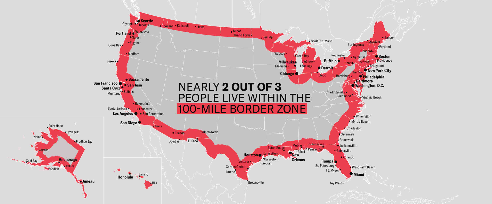

```{r}
#| include: false
knitr::opts_chunk$set(
  message    = FALSE,
  warning    = FALSE,
  comment    = "",
  cache      = FALSE,
  fig.retina = 3
)
```

The spatial analysis in this investigation builds `sf` objects from
multiple sources, transforms coordinate reference systems, computes
distances to boundaries, and identifies features within threshold zones.
These are the same operations that apply to watersheds, river networks,
gauge networks, and dam inventories across water resources work.

The techniques are built here on a familiar, nationally relevant
dataset: US cities. Every operation performed on this data, including
`st_union`, `st_combine`, `st_cast`, `st_distance`, `st_transform`, and
`gghighlight`, transfers directly to vector water resources data.

The analysis connects directly to recent policy discussions about border
enforcement and the so-called "100-mile" border zone. Shifts in
migration policy after the end of the pandemic-era Title 42 expulsions
in 2023 renewed attention on how proximity to the border affects
enforcement, resource allocation, and civil liberties (see coverage:
https://www.reuters.com/world/us/us-ceases-using-title-42-pandemic-order-control-migration-2023-05-11/).
More recent operational discussions involving ICE and border enforcement
through 2025 to 2026 have emphasized how interior and border-zone
enforcement strategies depend on distance-to-border metrics; summaries
on civil-liberties implications (ACLU) and policy analyses that discuss
the "100-mile" enforcement footprint provide background:
https://www.aclu.org/know-your-rights/border-zone,
https://www.americanimmigrationcouncil.org/blog/border-patrol-charlotte-atlanta-100-mile-zone/.

The analysis draws on four main spatial skills: building `sf` objects
from R packages and CSV files (Q1), manipulating geometries and
coordinate systems (Q2), calculating distances using geometry type
selection (Q2), and visualizing spatial patterns with `ggplot2`,
`gghighlight`, and `ggrepel` (Q3 and Q4).

::: callout-tip
## Why these skills matter for water resources

Computing distance from a point to a boundary is one of the most common
operations in spatial hydrology: distance from a gauge to a watershed
outlet, distance from a city to the nearest floodplain, distance from a
well to the nearest stream. The mechanics are identical regardless of
what the features represent.
:::

The libraries below support the full workflow:

```{r}
#| code-fold: false
pacman::p_load(
  tidyverse, sf, units, tigris, rnaturalearth, gghighlight, ggrepel, flextable
)

options(tigris_use_cache = TRUE)
```

------------------------------------------------------------------------

# Building the Spatial Dataset {#q1}

The analysis needs three datasets: CONUS state boundaries (1.1), North
American country boundaries for the US, Mexico, and Canada (1.2), and
all US cities (1.3).

## 1.1 Define a Projection

Distance calculations require a projected coordinate system that
minimizes distance distortion at the scale of CONUS. This analysis uses
the **North America Equidistant Conic**:

```{r}
#| code-fold: false
eqdc <- '+proj=eqdc +lat_0=40 +lon_0=-96 +lat_1=20 +lat_2=60 +x_0=0 +y_0=0 +datum=NAD83 +units=m +no_defs'
```

This PROJ string defines an Equidistant Conic projection (`+proj=eqdc`)
centered at 40°N (`+lat_0=40`) on the 96°W central meridian
(`+lon_0=-96`), with standard parallels at 20°N and 60°N (`+lat_1=20`,
`+lat_2=60`), using the North American Datum 1983 (`+datum=NAD83`) and
output in meters (`+units=m`). Distortion is minimized between the two
standard parallels, and 20°N to 60°N encompasses all of CONUS, which
makes this projection well-suited for national-scale distance analysis.

## 1.2 CONUS State Boundaries

US state boundaries come from `tigris::states()`, which pulls directly
from the US Census Bureau TIGER/Line files. The state codes (`STUSPS`)
are filtered to exclude Alaska, Hawaii, and US territories, and the
result is reprojected to the equidistant projection with
`st_transform(eqdc)`.

```{r}
state_boundaries <- tigris::states(cb = TRUE, progress_bar = FALSE) 

states <- state_boundaries %>% 
  filter(!(STUSPS %in% c("AK", "HI", "AS", "GU", "MP", "PR", "VI", "DC"))) %>% 
  st_transform(eqdc)
```

## 1.3 North American Country Boundaries

Country boundaries for the United States, Canada, and Mexico come from
`rnaturalearth::ne_countries()`, which returns an `sf` object directly
when `returnclass = "sf"` is specified. The `admin` column is filtered
to keep only the three countries needed, then transformed to `eqdc`.

```{r}
countries <-  rnaturalearth::ne_countries(returnclass = "sf") %>% 
  filter(admin %in% c("United States of America", "Canada", "Mexico")) %>% 
  st_transform(eqdc)  

```

## 1.4 US City Locations

The city data comes from the free basic dataset at
[simplemaps.com/data/us-cities](https://simplemaps.com/data/us-cities).
The raw data is tabular, with coordinates stored as numeric columns
rather than geometry, so it is converted to a spatial object with
`st_as_sf()`. Raw lat/lon from a CSV is almost always WGS84 (EPSG:4326).
After creating the `sf` object, rows that fall outside CONUS are removed
by filtering against the `st_union(states)` boundary.

```{r}
cities_data_reference <- "https://simplemaps.com/data/us-cities"

cites_df <- read_csv("data/uscities.csv")

cities_sf <- cites_df %>% st_as_sf(coords = c("lng", "lat"), crs = "EPSG:4326") %>% 
  st_transform(eqdc)

us_border <- st_union(states) 

cities <- cities_sf %>% st_filter(us_border)

# verify the filter returns only conus cites 
length(unique(cities$state_name))

st_crs(states) == st_crs(countries)
st_crs(states) == st_crs(cities)

# Row counts should be reasonable
nrow(states)    # should be 48
nrow(cities)    # should be ~28,000

# All projections match, object sizes are within expected range 
```

All three datasets are verified before proceeding, since a CRS mismatch
here would silently corrupt every distance calculation downstream: the
CRS of all three objects matches, and the row counts are reasonable (48
states, roughly 28,000 cities).

------------------------------------------------------------------------

# Distance Calculations {#q2}

This section calculates the distance from each US city to four
boundaries: the US national border (coastline plus land borders,
resolved), the nearest state border (internal boundaries preserved), the
Mexican border, and the Canadian border.

In all cases, since the goal is distance to a **border** (a line), the
polygon geometries have to be cast to `MULTILINESTRING` before computing
distances. A `POLYGON` or `MULTIPOLYGON` returns a distance of 0 to its
interior, while a `MULTILINESTRING` returns distance to the boundary
line, which is what is actually wanted here. The choice of `st_union`
vs. `st_combine` determines whether interior boundaries are dissolved or
preserved, a distinction that matters for 2.1 and 2.2.

## 2.1 Distance to US National Border (km)

The national border is the **resolved** outer boundary of all states,
with internal state lines dissolved so only the coastline and land
borders remain. `st_union()` merges all state polygons into a single
boundary, the result is cast to `MULTILINESTRING`, and `st_distance()`
computes the distance, converted to kilometers with `set_units()`. The
result is stored as `dist_to_border`, and the table below shows the 5
cities farthest from the national border.

```{r}
plot(us_border)

cities_dist <- cities %>% 
  mutate(
    dist_to_border = set_units(
      st_distance(., us_border %>%  st_cast("MULTILINESTRING")), "km"
      )
    )

cities_dist %>% 
  slice_max(dist_to_border, n = 5) %>% 
  select(city, state_id,dist_to_border) %>% 
  st_drop_geometry() %>% 
  flextable() %>% 
  set_header_labels(
    city = "City",
    dist_to_border = "Distance to Border",
    state_id = "State"
  ) %>% 
  set_caption(caption = "Top 5 CONUS cities farthest from the border") %>% 
  autofit()
```

## 2.2 Distance to Nearest State Border (km)

The nearest state border uses **preserved** internal boundaries, since
every state line is wanted here, not just the outer edge. `st_combine()`
keeps all boundaries, and the result is again cast to `MULTILINESTRING`.
The distance is stored as `dist_to_state`. The answers for 2.1 and 2.2
differ because the city farthest from the national border might still be
close to a state line, while the city farthest from any state line has
to be far from all internal and external borders.

```{r}
cities_dist <- cities_dist %>% 
  mutate(
    dist_to_state = set_units(
      st_distance(.,states %>%  st_combine() %>% st_cast("MULTILINESTRING")), 
      "km"))

cities_dist %>% 
  slice_max(dist_to_state, n = 5) %>% 
  select(city, state_id,dist_to_state) %>% 
  st_drop_geometry() %>% 
  flextable() %>% 
  set_header_labels(
    city = "City",
    dist_to_state = "Distance to State Border",
    state_id = "State"
  ) %>% 
  set_caption(caption = "Top 5 CONUS cities farthest from a state border") %>% 
  autofit()
```

## 2.3 Distance to Mexico (km)

Mexico is isolated from the countries object, cast to `MULTILINESTRING`,
and the distance from each city is computed and stored as
`dist_to_mexico`. The table shows the 5 cities farthest from Mexico.

```{r}
cities_dist <- cities_dist %>% 
  mutate(
    dist_to_mexico = set_units(
      st_distance(.,countries %>% 
                    filter(admin == "Mexico") %>% 
                    st_cast("MULTILINESTRING")), "km"))

cities_dist %>% 
  slice_max(dist_to_mexico, n = 5) %>% 
  select(city, state_id, dist_to_mexico) %>% 
  st_drop_geometry() %>% 
  flextable() %>% 
  set_header_labels(
    city = "City",
    dist_to_mexico = "Distance to Mexico",
    state_id = "State"
  ) %>% 
  set_caption(caption = "Top 5 CONUS cities farthest from Mexico") %>% 
  autofit()
```

## 2.4 Distance to Canada (km)

The same approach applies to Canada, stored as `dist_to_canada`. The
table shows the 5 cities farthest from Canada.

```{r}
cities_dist <- cities_dist %>% 
  mutate(
    dist_to_canada = set_units(
      st_distance(.,countries %>% 
                    filter(admin == "Canada") %>% 
                    st_cast("MULTILINESTRING")), 
      "km"))

cities_dist %>% 
  slice_max(dist_to_canada, n = 5) %>% 
  select(city, state_id, dist_to_canada) %>% 
  st_drop_geometry() %>% 
  flextable() %>% 
  set_header_labels(
    city = "City",
    dist_to_canada = "Distance to Canada",
    state_id = "State"
  ) %>% 
  set_caption(caption = "Top 5 CONUS cities farthest from Canada") %>% 
  autofit()
```

------------------------------------------------------------------------

# Mapping Distance Patterns {#q3}

The distance data computed above is visualized here with `ggplot2`,
`ggrepel::geom_label_repel()` for non-overlapping city labels, and
`gghighlight` to emphasize subsets.

## 3.1 Reference Map

A base reference map showing North America (US, Canada, Mexico) as
filled grey polygons, CONUS state boundaries as dashed lines, and the 10
largest US cities by population as labeled points.
`stat = "sf_coordinates"` extracts point coordinates from the geometry
for label placement, which is required when using `ggrepel` with `sf`
objects.

```{r}
base_map <- countries %>% 
  filter(admin != "United States of America") %>% 
  ggplot()+
  geom_sf()+
  geom_sf(data = states, linetype = "dashed")+
  geom_sf(data = us_border)+
  geom_sf(data =  cities_dist %>% slice_max(population, n = 10))+
  ggrepel::geom_label_repel(
  data = cities_dist %>% slice_max(population, n = 10),
  aes(geometry = geometry, label = city),
  stat = "sf_coordinates",
  size = 3,
  min.segment.length = 0,  
  box.padding = .5)+
  labs(title = "CONUS, Mexico, and Canda",
       subtitle = "With top 10 U.S. cities by population",
       caption = paste("Sources:", cities_data_reference, ", Tigris R Package"))+
  theme_void()

base_map
```

## 3.2 Distance to National Border

All US cities colored by their distance to the national border using a
continuous color scale, with the 5 cities farthest from the border
highlighted and labeled.

```{r}

# create a seperate layer to highlight 

top_5 <- cities_dist %>% 
  slice_max(dist_to_border, n = 5)

ggplot(cities_dist)+ 
  geom_sf(data = us_border)+
  geom_sf(data = cities_dist, aes(color = drop_units(dist_to_border)), size = .1)+
  scale_color_viridis_c()+
  ggrepel::geom_label_repel(data = cities_dist %>% slice_max(dist_to_border, n = 5),
  aes(geometry = geometry, label = city),
  stat = "sf_coordinates",
  size = 3,
  min.segment.length = 0,  
  box.padding = .5)+
  geom_sf(data = top_5, color = "red2", size = 1)+
   labs(title = "U.S. Cities",
       subtitle = "Top 5 farthest cities from the U.S border highlighted",
       color = "Distance to border (km)",
       caption = paste("Sources:", cities_data_reference, ", Tigris R Package"))+
  theme_void()+
  theme(plot.title = element_text(hjust = .5),
        plot.subtitle = element_text(hjust = .5))


```

All five the cities farthest from the border or located in northwest
Kansas, which makes sense given how Kansas is directly in the center of
CONUS and nearly equidistant to all U.S. borders.

## 3.3 Distance to Nearest State Border

All cities colored by distance to the nearest state border, with the 5
cities farthest from any state line highlighted and labeled.

```{r}
top_5 <- cities_dist %>% 
  slice_max(dist_to_state, n = 5)

ggplot(cities_dist)+ 
  geom_sf(data = cities_dist, aes(color = drop_units(dist_to_state)), size = .1)+
  scale_color_viridis_c()+
  labs(color = "Distance to state border (km)")+
  geom_sf(data = states, color = "black", size = .25)+
  geom_sf(data = us_border, size = .5)+
  ggrepel::geom_label_repel(data = cities_dist %>% slice_max(dist_to_state, n = 5),
  aes(geometry = geometry, label = city),
  stat = "sf_coordinates",
  size = 3,
  min.segment.length = 0,  
  box.padding = .5)+
  geom_sf(data = top_5, color = "red2", size = 1)+
   labs(title = "U.S. Cities",
       subtitle = "Top 5 farthest cities from a state border",
       caption = paste("Sources:", cities_data_reference, ", Tigris R Package"))+
  theme_void()+
  theme(plot.title = element_text(hjust = .5),
        plot.subtitle = element_text(hjust = .5))
```

The pattern in similar to 3.2, but we see it repeated on the state level
for every state. All the cities highlighted are in Texas, but Montana
and some of the large western states with a square shape like Colorado
and Nevada also have large interior areas.

## 3.4 Equidistance Zone: Mexico and Canada

Cities that are **approximately equidistant** from the Mexican and
Canadian borders, within ±100 km of equal distance from both. A variable
holds the absolute difference between the two distances, `gghighlight()`
emphasizes cities where that difference is less than 100 km, and the 5
most populous cities in the zone are labeled with `ggrepel`.

```{r}
cities_dist <- cities_dist %>% 
  mutate(dist_diff = as.numeric(drop_units(abs(dist_to_mexico - dist_to_canada))))

ggplot(cities_dist)+ 
  geom_sf(data = cities_dist, aes(color = dist_diff), size = .1)+
  scale_color_viridis_c()+
  geom_sf(data = states, color = "black", size = .25)+
  geom_sf(data = us_border, size = .5)+
  ggrepel::geom_label_repel(data = cities_dist %>% 
                            filter(dist_diff < 100) %>% 
                            slice_max(population, n = 5),
  aes(geometry = geometry, label = city),
  stat = "sf_coordinates",
  size = 3,
  min.segment.length = 0,  
  box.padding = .5)+
  gghighlight(dist_diff < 100, use_direct_label = FALSE) +
   labs(
       color = "distance from equidistant",
       title = "U.S. cities within 100 miles equidistant to Mexico and Canada",
       subtitle = "Top 5 most populous cities in zone labeled",
       caption = paste("Sources:", cities_data_reference, ", Tigris R Package"))+
  theme_void()+
  theme(plot.title = element_text(hjust = .5),
        plot.subtitle = element_text(hjust = .5))

```

In the Western U.S. the zone runs through the center of the country,
but once the zone passes the eastern border of Mexico the equidistant
area drops south and ends near the Georgia/Florida border. While, this
appears surprising at first, the calculation is to the border of
Mexico/Canada, not the U.S. border, and this means that the large
distance over the Gulf of Mexico move the zone south. This implies
that in the Eastern U.S. the climate influence of Mexico disappears
and is replaced with the oceanic influence of the Gulf, while the
mostly continuous land border with Canada means the Canadian climate
influence is more consistent.

------------------------------------------------------------------------

# The 100-Mile Border Zone {#q4}

Federal regulations give U.S. Customs and Border Protection (CBP)
authority to operate within **100 miles of any US "external boundary"**,
including both land borders and coastlines. Within this zone, CBP agents
can conduct stops and searches without a warrant or reasonable
suspicion, and federal courts have repeatedly upheld this authority. The
American Civil Liberties Union has documented and challenged this
policy; their analysis is
[here](https://www.aclu.org/other/constitution-100-mile-border-zone).

```{r}
#| echo: false
#| fig-align: center

```

100 miles is approximately **160 kilometers**, and the distance
calculations above are already in kilometers.

## 4.1 Quantify the Zone

Using the `dist_to_border` column, this counts how many cities fall
within the 100-mile zone, sums the total population living in those
cities, and computes what percentage of the total US city population
that represents, for comparison against the ACLU's published estimate.
Note that the total city population is referenced across the entire
dataset, not just the filtered rows.

```{r}
total_pop <- cities_dist %>% 
  summarise(conus_pop = sum(population)) %>% 
  st_drop_geometry() %>% 
  pull()

cities_dist %>% 
  st_drop_geometry() %>% 
  filter(as.numeric(dist_to_border) <= 160) %>% 
  summarise(
    zone_pop = sum(population),
    rel_pop = round((zone_pop / total_pop)*100, 1),
    total_cities = nrow(.)
  ) %>% 
  flextable() %>% 
  set_header_labels(
    zone_pop = "City pop. in zone",
    rel_pop = "% of total CONUS city pop.",
    total_cities = "Total cities in zone"
  ) %>% 
  set_caption(caption = "CONUS cities within 100 miles of U.S. border") %>% 
  autofit()
  
```


The ACLU estimates "roughly two-thirds of the United States'
population," live in the border zone, which is consistent with my
finding of 65.2%, although it is worth noting that the cities data set
population appears to be inflated from current U.S. census estimates.
This result may be unexpected to some because they don't consider
coastlines to be a border, but the CBP has authority within 100 miles
of an external boundary, not just a land border. A similar style of
analysis may be needed when working near lands administered by
agencies like the National Park Service, were actions regarding water
resources within a buffer to a park may require jurisdictional
approval of the park.

## 4.2 Map the Zone

A map highlighting all cities within the 100-mile zone using
`gghighlight`, colored by distance to the border on a gradient from
`"orange"` to `"darkred"`, with the 10 most populous cities in the zone
labeled.

```{r}
ggplot(data = cities_dist)+ 
  geom_sf(data = cities_dist, aes(color = as.numeric(dist_to_border)), size = .1)+
  geom_sf(data = states)+
  geom_sf(data = us_border, size = .5)+
  scale_color_gradient(low = "darkred", high = "orange")+
  gghighlight(as.numeric(dist_to_border) < 160, use_direct_label = FALSE) +
  ggrepel::geom_label_repel(data = cities_dist %>% 
                            filter(as.numeric(dist_to_border) <= 160) %>% 
                            slice_max(population, n = 10),
  aes(geometry = geometry, label = city),
  stat = "sf_coordinates",
  size = 3,
  min.segment.length = 0,  
  box.padding = .5)+
  geom_sf(data = cities_dist %>% 
                  filter(as.numeric(dist_to_border) <= 160) %>% 
                  slice_max(population, n = 10))+
   labs(
       color = "Distance to border (km)",
       title = "U.S. cities within 100 miles to a border",
       subtitle = "Top 10 most populous cities in zone labeled",
       caption = paste("Sources:", cities_data_reference, ", Tigris R Package"))+
  theme_void()+
  theme(plot.title = element_text(hjust = .5),
        plot.subtitle = element_text(hjust = .5))
```

## 4.3 Most Populous City per State in the Zone

The same map as 4.2, but instead of the 10 most populous overall, it
labels the **most populous city in each state** that falls within the
zone.

```{r}
ggplot(data = cities_dist)+ 
  geom_sf(data = cities_dist, aes(color = as.numeric(dist_to_border)), size = .1)+
  geom_sf(data = states)+
  geom_sf(data = us_border, size = .5)+
  scale_color_gradient(low ="darkred", high = "orange")+
  gghighlight(as.numeric(dist_to_border) < 160, use_direct_label = FALSE) +
   ggrepel::geom_label_repel(data = cities_dist %>% 
                            filter(as.numeric(dist_to_border) < 160) %>% 
                            group_by(state_name) %>% 
                            slice_max(population, n = 1),
  aes(geometry = geometry, label = city),
  stat = "sf_coordinates",
  size = 2,
  min.segment.length = 0,  
  box.padding = .5,
  max.overlaps = 20)+
  geom_sf(data = cities_dist %>% 
                  filter(as.numeric(dist_to_border) < 160) %>% 
                  group_by(state_name) %>% 
                  slice_max(population, n = 1))+
   labs(
       color = "Distance to border (km)",
       title = "U.S. cities within 100 miles to a border",
       subtitle = "Most populous city per state within zone labeled",
       caption = paste("Sources:", cities_data_reference, ", Tigris R Package"))+
  theme_void()+
  theme(plot.title = element_text(hjust = .5),
        plot.subtitle = element_text(hjust = .5))

# Number of states with a city in the zone 

cities_dist %>% 
  filter(as.numeric(dist_to_border) < 160) %>% 
  group_by(state_name) %>% 
  slice_max(population, n = 1) %>% 
  nrow()

```

There are 35 states with at least one city in the border zone. There
are some states that have their most populous city not in the zone,
for example Atlanta GA, Phoenix AZ, Billings MT, and Albuquerque NM,
however, the vast majority of population centers are located within
the zone, which is largely due to the big cities developing along
coastlines, while many of the states that have their most populous
city not in the zone are landlocked, and thus have less economic
incentive to develop large cities near a border. This zone could
create challenges for other federal agencies trying to regulate
environmental standards, as they might be limited by DHS authority
over the area.

------------------------------------------------------------------------

# Interactive Leaflet Map

This section ties the distance calculations and mapping from into
a single interactive web map: a compact `leaflet` map with layer
controls, informative popups, and two toggleable thematic layers, the
±100 km equidistance band (Mexico vs Canada) and the 100-mile
(approximately 160 km) national-border zone.

The map includes CONUS state boundaries and provider tile basemaps
(CartoDB and Esri satellite) as base layers, and three toggleable data
layers: all cities colored by distance to the national border via
`colorNumeric("viridis")`, cities in the equidistance zone highlighted
separately, and cities in the 100-mile border zone highlighted
separately. Clicking a city marker shows its name, state, population,
and distances to borders, and a legend shows what the color scale
represents. Since `leaflet` works with WGS84 coordinates (EPSG:4326),
the data is transformed before plotting.

```{r}
# Transform data to web mercator 

eq_cities <- cities_dist %>% 
  filter(as.numeric(dist_diff) <= 100)

zone_cities <- cities_dist %>% 
  filter(drop_units(dist_to_border) <= 160)

states_4326 <- st_transform(states, 4326)
cities_4326 <- st_transform(cities_dist, 4326)
eq_cities_4326 <- st_transform(eq_cities, 4326)
zone_cities_4326 <- st_transform(zone_cities, 4326)

  
library(leaflet)

# Add a color pallette 

pal <- leaflet::colorNumeric(palette = "viridis", 
                             domain = drop_units(cities_4326$dist_to_border))


# Popup function 

make_popup <- function(d) {
  paste0("<strong>", d$city, ", ", d$state_id, "</strong><br>",
         "Population: ", d$population, "<br>",
         "Distance to Mexico: ", round(d$dist_to_mexico, 0), " km<br>",
         "Distace to Canada: ", round(d$dist_to_canada, 0), " km") 
  }

leaflet() %>% 
  addProviderTiles(providers$CartoDB.Voyager, group = "Base Map") %>% 
  addProviderTiles(providers$Esri.WorldImagery, group = "Satellite") %>% 
  addPolygons(data = states_4326, fill = NA, color = "black", weight = 2) %>%
#   All cities
  addCircleMarkers(data = cities_4326, group = "All cities", 
                   fillColor = ~pal(drop_units(dist_to_border)),
                   color = NA, fillOpacity = 0.75,
                   popup = make_popup(cities_4326),
                   clusterOptions = markerClusterOptions(disableClusteringAtZoom = 7)) %>% 
#  Border cities
  addCircleMarkers(data = zone_cities_4326, group = "Border zone cities",
                   fillColor = "red",
                   color = "black", weight = 2, fillOpacity = 0.75,
                   popup = make_popup(zone_cities_4326)) %>% 
#   Eq Zone
  addCircleMarkers(data = eq_cities_4326, group = "Equidistant cities",
                   fillColor = "steelblue",
                   color = "black", weight = 2, fillOpacity = 0.75,
                   popup = make_popup(eq_cities_4326)) %>% 
#   Layer
  addLayersControl(baseGroups = c("Base Map", "Satellite"),
                  overlayGroups = c("All cities", "Equidistant cities", "Border zone cities"),
                  options = layersControlOptions(collapsed = FALSE)) %>%
#   Legend
  addLegend(pal = pal, values = drop_units(cities_dist$dist_to_border), title = "Dist (km)", 
            group = "All cities", position = "bottomright") %>%
  addLegend(colors = c("steelblue", "red"), labels = c("Equidistant", "Border Zone"), 
            group = c("Equidistant Zone", "Border Zone"), position = "bottomright")
  
  
```

All of the spatial objects needed to be transformed to the Mercator
projection, since that is the leaflet projection. I kept the all cities
layer grouped until below a zoom of 7 to keep the map responsive and
readable. The map rendered well with the existing level of detail in my
spatial layers, so I did not simplify any geometries.

------------------------------------------------------------------------

# Summary

This investigation built spatial datasets from three different sources:
a CRAN package (`tigris`), a data package (`rnaturalearth`), and a
downloaded CSV. It transformed coordinate reference systems and selected
a projection appropriate for national-scale distance analysis,
manipulated geometry types (understanding when to use `st_union` vs.
`st_combine`, and why casting to `MULTILINESTRING` is required before
computing distances to borders), computed four sets of distances with
`st_distance()` stored as labeled unit vectors, visualized spatial
patterns with continuous color scales, `gghighlight`, and `ggrepel`, and
built an interactive web map with `leaflet` to present distance data to
a general audience.

Every one of these operations recurs in water resources work, applied to
watersheds, river networks, elevation grids, and gauge networks. The
mechanics are the same regardless of what the features represent.
