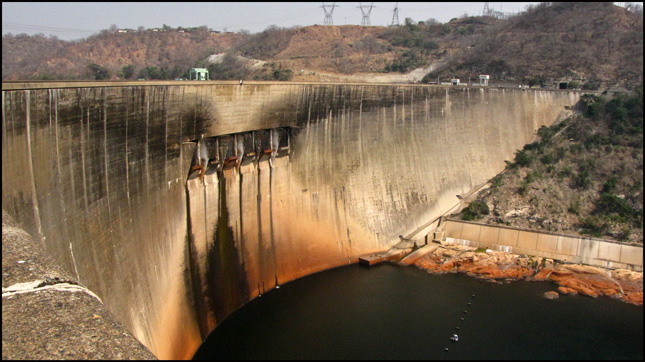

```{r}
#| include: false
knitr::opts_chunk$set(
  fig.width  = 8,
  message    = FALSE,
  warning    = FALSE,
  comment    = "",
  cache      = FALSE,
  fig.retina = 3
)
```

```{r}
#| echo: false
#| fig-align: center
#| out.width: '100%'


```

# Background

In this lab we will explore the impacts of tessellated surfaces and the
modifiable areal unit problem (MAUP) using the National Dam Inventory
maintained by the United States Army Corps of Engineers. The work
requires writing reusable functions and careful consideration of feature
aggregation/simplification, spatial joins, and data visualization. The
end goal is to visualize the distribution of dams and their purposes
across the country.

**DISCLAIMER**: This lab can be computationally intensive. For some
steps you may be processing hundreds of millions of relations; run code
chunk-by-chunk during development rather than knitting the whole
document repeatedly. Your final knit may take a few minutes. Be proud —
the report will summarize analyses over very large geometric relations.

------------------------------------------------------------------------

This lab covers 4 main skills:

1.  **Tessellating surfaces** to discretize space
2.  **Geometry simplification** to expedite expensive intersections
3.  **Writing functions** to automate repetitive reporting and mapping
    tasks
4.  **Point-in-polygon counts** to aggregate point data

## Graduate-Level Expectations

In addition to producing correct code and outputs, your submission
should:

-   **Justify methodological choices**: Why did you choose a particular
    tessellation `keep` percentage for simplification? How did you
    balance computational efficiency with map detail?
-   **Document performance impacts**: Measure and report computation
    time and geometric accuracy changes resulting from simplification.
    How do results differ?
-   **Apply spatial reasoning**: Use spatial predicates (e.g.,
    `st_touches`, `st_contains`) to identify and describe geometric
    relationships in the dam dataset that raw counts cannot reveal.
-   **Compare across methods**: When multiple tessellation approaches
    yield different clustering patterns, explain which pattern better
    supports real-world dam management decisions and why.
-   **Connect to lecture**: Explicitly cite the MAUP problem,
    simplification algorithms (Douglas-Peucker vs. Visvalingam), and
    spatial predicate definitions from week 3 lectures in your analysis.

### Libraries

```{r}
#| echo: false
#| eval: true
#| message: false
#| warning: false

# Load packages 
 #remotes::install_github("mikejohnson51/AOI") # get US counties

pacman::p_load(tidyverse, sf, rmapshaper, units, AOI, gghighlight, knitr, kableExtra, flextable, janitor)
```

------------------------------------------------------------------------

# Question 1:

Here we will prepare five tessellated surfaces from CONUS and write a
function to plot them in a descriptive way.

### Step 1.1

First, we need a spatial file of CONUS counties. For future area
calculations we want these in an equal area projection (`EPSG:5070`).

To achieve this:

-   get an `sf` object of US counties
    (`AOI::aoi_get(state = "conus", county = "all")`)

-   transform the data to `EPSG:5070`

```{r}

us_counties <- AOI::aoi_get(state = "conus", county = "all") %>% 
  st_transform(crs = "EPSG:5070")

head(us_counties)

# st_crs(us_counties)
```

### Step 1.2

For triangle based tessellations we need point locations to serve as our
"anchors".

To achieve this:

-   generate county centroids using `st_centroid`

-   Since, we can only tessellate over a feature we need to *combine* or
    *union* the resulting 3,108 `POINT` features into a single
    `MULTIPOINT` feature

-   Since these are point objects, the difference between union/combine
    is mute

```{r}

counties_cent <- st_centroid(us_counties) %>% 
  st_union()

ggplot() +
  geom_sf(data = us_counties, fill = NA)+
  geom_sf(data = counties_cent)+
  theme_void()
  
```

### Step 1.3

Tessellations/Coverage's describe the **extent** of a region with
geometric shapes, called **tiles**, with *no* overlaps or gaps.

**Tiles** can range in *size*, *shape*, *area* and have different
methods for being created.

Some methods generate triangular tiles across a set of defined points
(e.g. `Voronoi` and Delaunay triangulation)

Others generate equal area tiles over a known extent (`st_make_grid`)

For this lab, we will create surfaces of CONUS using using 4 methods, 2
based on an extent and 2 based on point anchors:

**Tessellations** :

-   `st_voronoi`: creates a Voronoi tessellation

-   `st_triangulate`: triangulates a set of points (not constrained)

**Coverages**:

-   `st_make_grid`: creates a square grid covering the geometry of an sf
    or sfc object

-   `st_make_grid(square = FALSE)`: creates a hexagonal grid covering
    the geometry of an sf or sfc object

-   The side of coverage tiles can be defined by a cell resolution or a
    specified number of cell in the X and Y direction

------------------------------------------------------------------------

For this step:

-   Make a voroni tessellation over your county centroids (`MULTIPOINT`)
-   Make a triangulated tessellation over your county centroids
    (`MULTIPOINT`)
-   Make a gridded coverage with n = 70, over your counties object
-   Make a hexagonal coverage with n = 70, over your counties object

In addition to creating these 4 coverage's we need to add an ID to each
*tile*.

To do this:

-   add a new column to each tessellation that spans from `1:n()`.

-   Remember that **ALL** tessellation methods return an `sfc`
    `GEOMETRYCOLLECTION`, and to add attribute information - like our
    ID - you will have to coerce the `sfc` list into an `sf` object
    (`st_sf` or `st_as_sf`)

Last, we want to ensure that our surfaces are topologically
valid/simple.

-   To ensure this, we can pass our surfaces through `st_cast`.

-   Remember that casting an object explicitly (e.g.
    `st_cast(x, "POINT")`) changes a geometry

-   If no output type is specified (e.g. `st_cast(x)`) then the cast
    attempts to simplify the geometry.

-   If you don't do this you might get unexpected "TopologyException"
    errors.

```{r}

voroni <- st_voronoi(counties_cent) %>% 
  st_cast() %>% 
  st_as_sf() %>% 
  mutate(id = 1:n()) 

triangle <- st_triangulate(counties_cent) %>% 
  st_cast() %>% 
  st_as_sf() %>% 
  mutate(id = 1:n()) 

square <- st_make_grid(us_counties, n = 70) %>% 
  st_cast() %>% 
  st_as_sf() %>% 
  mutate(id = 1:n()) 

hex <- st_make_grid(us_counties, n = 70, square = FALSE) %>% 
  st_cast() %>% 
  st_as_sf() %>% 
  mutate(id = 1:n()) 

# plot(hex)
```

### Step 1.4

If you plot the above tessellations you'll see that the **Voronoi**,
**Delaunay triangulation**, **hexagon**, and **square grids** all
produce regions far beyond the boundaries of CONUS.

We need to cut these boundaries to CONUS borders.

To do this, we need two different approaches: - **`st_intersection()`**
for Voronoi and Delaunay (these tessellations create geometries that
extend infinitely/far beyond the study area; intersection clips them at
the exact boundary) - **`st_filter()`** for hexagon and square grids
(these regular grids are already designed to fit; filtering keeps only
the tiles that intersect CONUS)

Either way, we'll need a geometry of CONUS to serve as our clipping
feature. We can get this by unioning our existing county boundaries.

```{r, eval = TRUE}

# create a U.S. border object to trip tesselations 
conus <- st_union(us_counties)


```

### Step 1.5

With a single feature boundary, we must carefully consider the
complexity of the geometry. Remember, the more points our geometry
contains, the more computations needed for spatial predicates our
differencing. For a task like ours, we do not need a finely resolved
coastal boarder.

To achieve this:

-   Simplify your unioned border using the Visvalingam algorithm
    provided by `rmapshaper::ms_simplify`.

-   Choose what percentage of vertices to retain using the `keep`
    argument and work to find the highest number that provides a shape
    *you* are comfortable with for the analysis:

```{r, eval = TRUE}

# simplify to remove 95% of points, visually inspected and minimal loss of detail. Level of simplification will be sufficient for my analysis 

simple_conus <- rmapshaper::ms_simplify(conus, keep = 0.05)

st_crs(simple_conus)
# plot(simple_conus)
```

::: callout-important
## Validation Checkpoint (Optional)

After simplification, verify the boundary is still valid and covers all
dams:

```{r}
#| eval: false
# Check the simplified boundary valid
st_is_valid(simple_conus)

# Check: Does it still contain all of CONUS?

st_bbox(simple_conus)  # Should cover roughly [-125, 24] to [-66, 49]

# Visual comparison

plot(conus, main = "Original")

plot(simple_conus, main = "Simplified")
```
:::

::: callout-note
## Simplification: Boundary Only, Not Tessellation

**Important distinction**: This step simplifies the **CONUS boundary
container** we use for clipping the tessellated surfaces. Simplification
affects *only* the geometry of the clipping operation — it speeds up the
intersection computation by reducing boundary vertices. Your
tessellation tiles themselves remain **high-resolution** and unchanged.
You are not simplifying the tessellation itself, only the container we
clip with.
:::

-   Once you are happy with your simplification, use the `mapview::npts`
    function to report the number of points in your original object, and
    the number of points in your simplified object.

-   How many points were you able to remove? What are the consequences
    of doing this computationally?

```{r}
print(paste(round((1 - (mapview::npts(simple_conus) / mapview::npts(conus))) *100, 1), "percent of points removed by simplification"))
```

-   Removing 95% of points will greatly decrease computation time going
    for operations involving the border

-   Finally, crop **all four grids** to the CONUS boundary—but using
    different methods:

    -   **Voronoi & Delaunay** (geometry-based tessellations): Use
        `st_intersection()` to *cut* these geometries at the CONUS
        boundary. These tessellations create boundaries that extend well
        beyond CONUS; intersection actually trims them.
    -   **Hexagon & Square grids** (regular grids): Use `st_filter()` to
        keep only tiles that touch CONUS. These grids are already
        regularly aligned; filtering just discards edge tiles without
        modifying them.

```{r}
# Intersection to clip triangle and vironi to exact border

voroni_trim <- st_intersection(voroni, simple_conus)

# compare run time with different geom
system.time(st_intersection(voroni, conus))
system.time(st_intersection(voroni, simple_conus))

triangle_trim <- st_intersection(triangle, simple_conus)

# function for evlauting compute times 

compare_speed <- function(task1, task2, task1_label = "Task 1", task2_label = "Task 2") {
  time1 <- system.time(task1)
  time2 <- system.time(task2)
  
  pct_decrease <- round((1 - (time2["elapsed"] / time1["elapsed"])) * 100, 1)
  
  cat("Task 1 (", task1_label, "):", time1["elapsed"], "sec\n")
  cat("Task 2 (", task2_label, "):", time2["elapsed"], "sec\n")
  cat(pct_decrease, "percent change in operation speed\n")
  
  invisible(list(task1 = time1, task2 = time2, pct_decrease = pct_decrease))
}


compare_speed(st_intersection(triangle, simple_conus), st_intersection(triangle,conus),
                      task1_label = "simple", task2_label = "complex")
  
# Use st_filter with intersect predicate maintains individual cells that have a portion of their geometry wihtin the border

square_trim <- st_filter(square, simple_conus)

hex_trim <- st_filter(hex, simple_conus)

compare_speed(st_filter(hex, simple_conus), st_filter(hex, conus))
```

::: callout-tip
## Why Different Cropping Methods?

**The distinction matters for your spatial analysis:**

-   **`st_intersection()` on Voronoi/Delaunay**: Produces
    edges/boundaries that align precisely with the CONUS border. Tiles
    at the edge are cut, not discarded. This is geometrically accurate
    but creates irregular edge shapes.

-   **`st_filter()` on hexagon/square grids**: Keeps only complete
    regular tiles that touch CONUS, discarding edge tiles. The boundary
    is a stair-step pattern following the regular grid.

**In Q3**, when you compare these tessellations, you'll notice that
Voronoi and Delaunay have denser tile coverage (e.g., \~2800–6200 tiles)
because they extend to the exact boundary. Hexagons and squares have
fewer tiles (e.g., \~1900–2000) because they're bound to a regular grid.
**This difference affects spatial statistics**: denser tessellations
reveal finer-grained patterns; coarser tessellations show broader
regional structure. This is part of the Modifiable Areal Unit Problem
(MAUP).
:::

### Step 1.6

The last step is to plot your tessellations. We don't want to write out
5 ggplots (or mindlessly copy and paste `r emo::ji("smile")`)

Instead, lets make a function that takes an `sf` object as *arg1* and a
character string as *arg2* and returns a ggplot object showing *arg1*
titled with *arg2*.

------------------------------------------------------------------------

The form of a function is:

```{r}
#| echo: true
#| eval: false

name = function(arg1, arg2) {
  
  ... code goes here ...
  
}
```

------------------------------------------------------------------------

For this function:

-   The name can be anything you chose, *arg1* should take an `sf`
    object, and *arg2* should take a character string that will title
    the plot

-   In your function, the code should follow our standard `ggplot`
    practice where your data is *arg1*, and your title is *arg2*

-   The function should also enforce the following:

    -   a `white` fill

    -   a `navy` border

    -   a `size` of 0.2

    -   \`theme_void\`\`

    -   a caption that reports the number of features in *arg1*

        -   You will need to paste character stings and variables
            together.

make_map(triangle_trim, "Triangle Tesselation")

make_map(square_trim, "Square Tesselation")

make_map(hex_trim, "Hexagon Tesselation")

```{r}
make_map <- function(sf_obj, title) {
  plot <- ggplot(data = sf_obj)+
            geom_sf(fill = "white", size = 0.2)+
            geom_sf(data = simple_conus, color = "navy", size = 0.5, fill = NA) +
            theme_void()+
            labs(title = title,
                 caption = paste(nrow(sf_obj), "features in layer"))+
            theme(plot.background = element_rect(colour = "navy", fill = NA, linewidth = 2),
                  plot.margin = margin(t = 0.5, r = 0.5, b = 0.5, l = 0.5, unit = "cm"),
                  plot.title = element_text(hjust = .5))
  return(plot)
}

```

### Step 1.7

Use your new function to plot each of your tessellated surfaces and the
original county data (5 plots in total):

```{r}
make_map(us_counties, "U.S. Counties")

make_map(voroni_trim, "Voroni Tesselation")

make_map(triangle_trim, "Triangle Tesselation")

make_map(square_trim, "Square Tesselation")

make_map(hex_trim, "Hexagon Tesselation")
```

# Question 2:

In this question, we will write out a function to summarize our
tessellated surfaces.

### Step 2.1

First, we need a function that takes a `sf` object and a `character`
string and returns a `data.frame`.

For this function:

-   The function name can be anything you chose, *arg1* should take an
    `sf` object, and *arg2* should take a character string describing
    the object

-   In your function, calculate the area of `arg1`; convert the units to
    km^2^; and then drop the units

-   Next, create a `data.frame` containing the following:

    1.  text from *arg2*

    2.  the number of features in *arg1*

    3.  the mean area of the features in *arg1* (km^2^)

    4.  the standard deviation of the features in *arg1*

    5.  the total area (km^2^) of *arg1*

-   Return this `data.frame`

```{r}
sum_tess <- function(sf_obj, description) {
  
  area_km2 <- sf_obj %>% 
    st_area() %>% 
    units::set_units(km^2) %>% 
    units::drop_units()
  
  data.frame(
    description    = description,
    n_features     = nrow(sf_obj),
    mean_area_km2  = mean(area_km2),
    sd_area_km2    = sd(area_km2),
    total_area_km2 = sum(area_km2)
  )
}
```

### Step 2.2

Use your new function to summarize each of your tessellations and the
original counties.

```{r}

sum_tess(voroni_trim, "Voroni Tesselation")
sum_tess(triangle_trim, "Triangle Tesselation")
sum_tess(square_trim, "Square Tesselation")
sum_tess(hex_trim, "Hexagon Tesselation")
```

### Step 2.3

Multiple `data.frame` objects can bound row-wise with `bind_rows` into a
single `data.frame`

For example, if your function is called `sum_tess`, the following would
bind your summaries of the triangulation and voroni object.

```{r, eval = TRUE}
 tess_comp <-  bind_rows(
   sum_tess(voroni_trim, "Voroni Tesselation"),
   sum_tess(triangle_trim, "Triangle Tesselation"),
   sum_tess(square_trim, "Square Tesselation"),
   sum_tess(hex_trim, "Hexagon Tesselation"),
   )
```

### Step 2.4

Once your 5 summaries are bound (2 tessellations, 2 coverage's, and the
raw counties) print the `data.frame` as a nice table using
`knitr`/`kableExtra`/`flextable` or your preferred table formatting
package.

```{r, echo = FALSE}

tess_comp %>% 
  mutate(mean_area_km2 = round(mean_area_km2, 1),
         sd_area_km2 = round(sd_area_km2, 1)) %>% 
  flextable() %>% 
  set_header_labels(
    description = "Tesselation",
    n_features = "N features",
    mean_area_km2 = "Mean area (km2)",
    sd_area_km2 = "SD area (km2)",
    total_area_km2 = "Total area (km2)"
  ) %>% 
  set_caption(caption = "Tesselation method area comparison") %>% 
  autofit()

# need to write out
```

### Step 2.5

Comment on the traits of each tessellation. Be specific about how these
traits might impact the results of a point-in-polygon analysis in the
contexts of the modifiable areal unit problem and with respect
computational requirements.

------------------------------------------------------------------------

# Question 3: Dam Distribution Analysis & Tessellation Selection

The data we will analyze in this lab are from the U.S. Army Corps of
Engineers National Dam Inventory (NID). This dataset documents \~91,000
dams in the United States and includes attributes such as design
specifications, risk level, age, and purpose.

Dam management agencies face a critical question: **Where are dams
actually clustered, and how do I visualize that clustering in a way that
supports infrastructure planning decisions?** The answer depends on your
choice of geographic boundaries—that is, your tessellation. Different
tessellations will reveal different patterns of dam concentration. Your
job in this question is to:

1.  Quantify dam distributions across multiple tessellation methods
2.  Understand how the **modifiable areal unit problem (MAUP)** creates
    different narratives from the same underlying data
3.  **Select and justify the tessellation that best supports management
    decisions** about dam clustering

For the remainder of this lab we will analyze the distributions of these
dams using point-in-polygon analysis.

### Step 3.1

In the tradition of this class - and true to data science/GIS work - you
need to find, download, and manage raw data. THe NID dataset is
available as a CSV download from the USACE website
[here](https://nid.sec.usace.army.mil/nid/#/downloads). Grab the CSV.

-   Return to your RStudio Project and read the data in using the
    `readr::read_csv`
    -   Use `janitor::clean_names()` to standardize column names to
        snake_case (tidy data convention)
    -   After reading the data in, be sure to remove rows that don't
        have location values (`!is.na()`)
    -   Convert the `data.frame` to a `sf` object by defining the
        coordinates and CRS
    -   Transform the data to a CONUS AEA (EPSG:5070) projection -
        matching your tessellation
    -   Filter to include only those within your CONUS boundary

::: callout-note
## Data Cleaning with janitor

The NID CSV has messy column names (all caps with spaces). The
`janitor::clean_names()` function converts them to clean snake_case
(`LONGITUDE` → `longitude`, `DAM NAME` → `dam_name`). This is a
lightweight utility that saves time and prevents typos in downstream
code. It's part of data wrangling best practice.
:::

```{r}
#| message: false

# Prefer a local NID CSV named `nation.csv`; otherwise download to that filename
nid_url <- "https://nid.sec.usace.army.mil/api/nation/csv"
dir.create("data", showWarnings = FALSE)
nid_dest <- "data/nation.csv"
if (file.exists(nid_dest)) {
  message("Using local NID file: ", nid_dest)
} else {
  tryCatch({
    message("Downloading NID CSV to: ", nid_dest)
    download.file(nid_url, nid_dest, quiet = FALSE, mode = "wb")
  }, error = function(e) {
    message("NID download failed: ", e$message)
  })
}

# read the CSV (will error if download failed and file missing)
if (!file.exists(nid_dest)) stop("NID CSV not found at ", nid_dest)
dams <- readr::read_csv(nid_dest, skip =1, show_col_types = FALSE) |> 
  janitor::clean_names()

usa <- AOI::aoi_get(state = "conus") %>% 
  st_union() %>% 
  st_transform(5070)

dams2 <- dams %>% 
  filter(!is.na(latitude)) %>%
  st_as_sf(coords = c("longitude", "latitude"), crs = 4326) %>% 
  st_transform(5070) %>% 
  st_filter(usa)


```

### Step 3.2

Following the in-class examples develop an efficient point-in-polygon
function that takes:

-   points as `arg1`,
-   polygons as `arg2`,
-   The name of the id column as `arg3`

The function should make use of spatial and non-spatial joins, sf
coercion and `dplyr::count`. The returned object should be input `sf`
object with a column - `n` - counting the number of points in each tile.

::: callout-important
## Point-in-Polygon Function Design Notes

1.  **CRS Matching**: Ensure `points` and `polygons` are in the same CRS
    before calling `st_join()`. If they differ, use `st_transform()` to
    align them first.

2.  **Empty Polygons**: `st_join(...) %>% count(id)` creates one row per
    intersection found. Polygons with *zero* intersections will appear
    in the result with `n = 0` **only if** you use a *left join*
    (default for `st_join()`). If a polygon has no points, make sure
    your result still includes it; if not, use
    `st_join(...) %>% right_join(...)` or initialize counts explicitly.

3.  **Sparse vs. Dense Matrices**: In this step you're not creating
    matrices. However, in Q6.1 you'll use
    `st_touches(..., sparse = FALSE)` to build neighbor matrices
    explicitly. Here in Q3, `st_join()` handles the spatial predicate
    internally (`st_intersects` by default), so you won't set
    sparsity—just know that `st_join()` scales well to large datasets.
    For troubleshooting performance: if your function runs slowly with
    91,000 dams, check whether your tessellation polygons are
    topologically simple (use `st_is_valid()`).
:::

```{r}

point_in_polygon <- function(points, polygon, id_column) {
  
  if (!inherits(points, "sf")) stop("Points must be sf object")
  if (!inherits(polygon, "sf")) stop("Polygon must be sf object")
  
  tryCatch({
    if (st_crs(points) != st_crs(polygon)) {
      print("CRS do not match, transforming to polygon CRS")
    }
    points <- st_transform(points, st_crs(polygon))
  }, error = function(e) {
    print(paste("CRS transform failed:", e$message))
    stop(e)
  })
  
  tryCatch({
 
 result <-  st_join(polygon, points) %>% 
    st_drop_geometry() %>%  
    count(get(id_column)) %>% 
    setNames(c(id_column, "n")) %>% 
    left_join(polygon, by = id_column) %>% 
    st_as_sf()
 
   return(result)
    
  }, error = function(e) {
    print(paste("Spatial join failed:", e$message))
    stop(e)
  })
}
```

### Step 3.3

Apply your point-in-polygon function to each of your five tessellated
surfaces where:

-   Your points are the dams
-   Your polygons are the respective tessellation
-   The id column is the name of the id columns you defined.

```{r}

voroni_pip <- point_in_polygon(dams2, voroni_trim, id_column = "id")

triangle_pip <- point_in_polygon(dams2, triangle_trim, id_column = "id")

square_pip <- point_in_polygon(dams2, square_trim, "id")

hex_pip <- point_in_polygon(dams2, hex_trim, "id")

counties_id <- us_counties %>% 
  mutate(id = 1:n())

counties_pip <- point_in_polygon(dams2, counties_id, "id")
```

### Step 3.4

Lets continue the trend of automating our repetitive tasks through
function creation. This time make a new function that extends your
previous plotting function.

For this function:

-   The name can be anything you chose, *arg1* should take an `sf`
    object, and *arg2* should take a character string that will title
    the plot

-   The function should also enforce the following:

    -   the fill aesthetic is driven by the count column `n`

    -   the col is `NA`

    -   the fill is scaled to a continuous `viridis` color ramp

    -   `theme_void`

    -   a caption that reports the number of dams in *arg1* (e.g.
        `sum(n)`)

        -   You will need to paste character stings and variables
            together.

```{r}
pip_plot <- function(sf_obj, title) {
  plot <- ggplot(data = sf_obj)+
            geom_sf(aes(fill = log10(n)))+
            scale_fill_viridis_c()+
            theme_void()+
            labs(title = title,
                 fill = "log number of damns",
                 caption = paste("Total Number with dams", sum(sf_obj$n))
                 )+
            theme(plot.background = element_rect(colour = "navy", fill = NA, linewidth = 2),
                  plot.margin = margin(t = 0.5, r = 0.5, b = 0.5, l = 0.5, unit = "cm"),
                  plot.title = element_text(hjust = .5, size = 13, color = "navy"),
                  legend.title = element_text(size = 9))
  return(plot)
}
```

### Step 3.5

Apply your plotting function to each of the 5 tessellated surfaces with
Point-in-Polygon counts:

```{r}

voroni_plot <- pip_plot(voroni_pip, "Voroni Tesselation with dams")

triangle_plot <- pip_plot(triangle_pip, "Triangle Tesselation with dams")

square_plot <- pip_plot(square_pip, "Square Tesselation with dams")

hex_plot <- pip_plot(hex_pip, "Hexagon Tesselation with dams")

counties_plot <-  pip_plot(counties_pip, "Counties with dams")
```

### Step 3.6

**Policy Analysis: Tessellation and Decision-Making**

Now that you have dam counts across all five tessellation methods,
compare the results. Specifically:

**a.** Create a side-by-side visualization (faceted or small multiples)
showing dam clustering under each of the five tessellations. Use
`patchwork` or `cowplot` to arrange the 5 plots you created in Step 3.5
for direct visual comparison.

**b.** Identify **2–3 geographic regions** where tessellation choice
produces substantially *different* patterns (e.g., one method shows a
clear hotspot while another shows diffuse distribution). For each
region, describe the pattern difference and explain *why* the
tessellation geometry creates divergent results. Reference the
characteristics from your Q2 summary (number of tiles, mean area,
standard deviation).

**c.** **Which single tessellation would you recommend to a dam
operations manager seeking to understand geographic clustering?**
Justify your choice by addressing: - Does the tessellation align with
natural or management decision-making units (e.g., river basins, states,
hydrologic regions)? - Does it reveal meaningful patterns without
over-fragmenting the landscape or creating artificial boundaries? - How
does MAUP influence your recommendation—are other tessellations equally
valid, just for different questions? - How did simplification affect
your choice? Would a coarser or finer simplification (different `keep`
percentage) change your recommendation? - What does "best supports
management decisions" mean concretely in your context—does it matter
more that hot spots are obvious, or that boundaries align with
jurisdictions?

Your answer should be **3–4 paragraphs** and grounded in the actual
visualizations and patterns you observe from your tessellation
comparisons.

```{r}

library(patchwork)

voroni_plot + triangle_plot + square_plot + hex_plot + counties_plot +
  plot_layout(ncol = 2) 
```

------------------------------------------------------------------------

# Question 4

The NID provides a comprehensive data dictionary
[here](https://files.hawaii.gov/dbedt/op/gis/data/nid_dams_data_dictionary.htm#Purposes).
In it we find that dam purposes are designated by a character
[code](https://files.hawaii.gov/dbedt/op/gis/data/nid_dams_data_dictionary.htm#Purposes).

These are shown below for convenience (built using knitr on a data.frame
called `nid_classifier`):

```{r}
#| echo: false
#| eval: true

nid_classifier = data.frame(matrix(c('I' , 'Irrigation',
'H' , 'Hydroelectric',
'C' , 'Flood Control',
'N' , 'Navigation',
'S' , 'Water Supply',
'R' , 'Recreation',
'P' , 'Fire Protection',
'F' , 'Fish and Wildlife',
'D' , 'Debris Control',
'T' , 'Tailings',
'G' , 'Grade Stabilization',
'O' , 'Other'), ncol = 2, byrow = T)) %>% 
  setNames(c("abbr", "purpose"))
```

```{r}
#| echo: false
#| eval: true

knitr::kable(nid_classifier,              
        caption = "NID 2019: Dam Purposes",
        format.args = list(big.mark = ",")) %>% 
    kableExtra::kable_styling("striped", full_width = TRUE, font_size = 14)
```

-   In the data dictionary, we see a dam can have *multiple* purposes.

-   In these cases, the purpose codes are concatenated in order of
    decreasing importance. For example, `SCR` would indicate the primary
    purposes are *Water Supply*, then *Flood Control*, then
    *Recreation.*

-   A standard summary indicates there are over 400 unique combinations
    of dam purposes:

```{r, echo = TRUE, eval = TRUE}
unique(dams2$purposes) %>% length()
```

-   By storing dam codes as a concatenated string, there is no easy way
    to identify how many dams serve any one purpose... for example where
    are the hydro electric dams?

------------------------------------------------------------------------

To overcome this data structure limitation, we can identify how many
dams serve each purpose by splitting the PURPOSES values (`strsplit`)
and tabulating the unlisted results as a data.frame. Effectively this is
double/triple/quadruple counting dams bases on how many purposes they
serve:

```{r}
#| echo: false
#| eval: false
# create a vector of all characters in your purpose and unlist 
dam_freq <- strsplit(dams2$purposes, split = "")%>%
  unlist() %>% 
  table() %>% 
  as.data.frame() %>% 
  setNames(c("abbr", "count")) %>% 
  left_join(nid_classifier) %>% 
  mutate(lab = paste0(purpose, "\n(", abbr, ")"))
```

The result of this would indicate:

```{r}
#| echo: false
#| eval: false

ggplot() + 
  geom_col(data = dam_freq, aes(x = reorder(lab, -count), y = count, fill = purpose), alpha = .8) + 
  labs(x = "", y = "# Dams", title = "Number of Dams serving each purpose")  +
  scale_fill_viridis_d()+ 
  theme_linedraw() +
  theme(axis.text.x = element_text(angle = 45, vjust = .9, hjust = 1)) + 
  theme(legend.position = 'none')
```

### Step 4.1

-   Your task is to create point-in-polygon counts for at *least* 4 of
    the above dam purposes:

-   You will use `grepl` to filter the complete dataset to those with
    your chosen purpose

-   Remember that `grepl` returns a boolean if a given pattern is
    matched in a string

-   `grepl` is vectorized so can be used in `dplyr::filter`

------------------------------------------------------------------------

For example:

```{r}
#| echo: true
#| eval: true
# Find flood control dams in the first 5 records:
dams2$purposes[1:5]
grepl("S", dams2$purposes[1:5])
```

------------------------------------------------------------------------

For your analysis, choose *at least* four of the above codes, and
describe why you chose them. Then for each of them, create a subset of
dams that serve that purpose using `dplyr::filter` and `grepl`

Finally, use your `point-in-polygon` function to count each subset
across your **cropped tessellation from Q1.4** (e.g., `hexagon_clipped`
or `square_clipped`).

```{r}
supply_subset <- dams2 %>% 
    filter(grepl("Water Supply", dams2$purposes) == TRUE) %>% 
  point_in_polygon(hex_trim, "id")


rec_subset <- dams2 %>% 
  filter(grepl("Recreation", dams2$purposes) == TRUE) %>% 
    point_in_polygon(hex_trim, "id")

fire_subset <-   dams2 %>% 
    filter(grepl("Fire Protection", dams2$purposes) == TRUE) %>% 
    point_in_polygon(hex_trim, "id")

fish_subset <- dams2 %>% 
    filter(grepl("Fish and Wildlife", dams2$purposes) == TRUE) %>% 
    point_in_polygon(hex_trim, "id")

```

### Step 4.2

-   Now use your plotting function from Q3 to map these counts on the
    **cropped tessellation**.

-   *But!* you will use `gghighlight` to **only** color those tiles
    where the count (*n*) is greater then the
    (`mean + 1 standard deviation`) of the set

-   Since your plotting function returns a `ggplot` object already, the
    `gghighlight` call can be added "`+`" directly to the function.

-   The result of this exploration is to highlight the areas of the
    country with the most

```{r}

supply_subset %>% 
  pip_plot("Dams with a Supply Purpose")+
  gghighlight(n > mean(n) + sd(n)) +
  labs(caption = "Tiles where the dam count is greater then the (mean + 1 standard deviation) are highlighted")

rec_subset %>% 
  pip_plot("Dams with a Recreation Purpose")+
  gghighlight(n > mean(n) + sd(n)) +
  labs(caption = "Tiles where the dam count is greater then the (mean + 1 standard deviation) are highlighted")

fire_subset %>% 
  pip_plot("Dams with a Fire Supression Purpose")+
  gghighlight(n > mean(n) + sd(n)) +
  labs(caption = "Tiles where the dam count is greater then the (mean + 1 standard deviation are highlighted")


fish_subset %>% 
  pip_plot("Dams with a Fish and Wildlife Purpose")+
  gghighlight(n > mean(n) + sd(n)) +
  labs(caption = "Tiles where the dam count is greater then the (mean + 1 standard deviation are highlighted")

```

### Step 4.3

Comment on the geographic distribution of dams you found. Does it make
sense? How might the tessellation you chose impact your findings? How
does the distribution of dams coincide with other geographic factors
such as river systems, climate, ect?

**Optional: Connect to Q6** — For purposes you chose in Q4, hypothesize
in 1–2 sentences: *"Will \[irrigation/hydroelectric\] dams show the same
LISA hotspots as all dams in Q6, or different patterns? Why?"* After
completing Q6, revisit this hypothesis.

# Question 5: Spatial Correlation of Dam Attributes — Introduction to Spatial Regression

Dam characteristics—such as **age, surface area, storage capacity, and
purpose**—vary geographically. Understanding the spatial structure of
these relationships is foundational to spatial regression modeling
(upcoming topics). In this question, you'll examine whether dam
attributes exhibit **spatial dependence** and assess whether neighboring
tiles have correlated characteristics.

::: callout-note
## Spatial Regression Motivation (Week 3-1 Foundation)

Standard regression assumes observations are **independent**. But
spatial data often violates this: dams in the Pacific Northwest likely
share design and management practices, leading to **spatially correlated
residuals**. This spatial dependence can bias confidence intervals and
inflate significance tests in standard OLS regression.

The solution involves **spatial lag models** (Spatial Autoregressive,
SAR) or **spatial error models** (SEM) that explicitly model dependence
via neighbor relationships. This lab asks: *Do your tessellation
neighborhoods reveal spatial structure in dam attributes?*

**For this question, use your cropped tessellation from Q1.4** (your
recommended tessellation from Q3, clipped to the CONUS boundary). You'll
examine whether dam attributes (age, size, count) are spatially
autocorrelated—evidence that neighboring tiles have similar values,
violating independence assumptions.
:::

### Step 5.1

**Aggregate Dam Attributes by Tile**

Using your **cropped tessellation from Q1.4** (your recommended grid
from Q3, clipped to CONUS boundary), compute **mean and variance** of
key dam attributes within each tile. The NID dataset typically includes:

-   **Age**: `year_completed` or similar (compute mean age per tile)
-   **Size**: `surface_area_acres` or `normal_pool_elevation` (compute
    mean per tile)
-   **Purpose codes**: `purposes` field (compute dominant purpose per
    tile; count of dams by purpose)

Aggregate as follows:

```{r}
#| eval: false
# Suggested workflow (write your own implementation):
# 1) spatial join dams to your cropped tessellation
# 2) group by tile id and summarize n_dams, mean_year_completed, mean_surface_area
# 3) join summaries back to geometry and preserve zero-dam tiles
# 4) inspect distributions before mapping
```

**Produce visualizations** showing spatial patterns:

-   Map 1: Mean dam age by tile (use viridis scale)
-   Map 2: Mean surface area by tile
-   Map 3: Dam count by tile (you already have this from Q3)

Do you see geographic clustering of old vs. new dams? Large vs. small
dams?

```{r}

dam_attr <- hex_trim %>% 
  st_join(dams2) %>% 
  st_drop_geometry() %>% 
  group_by(id) %>% 
  summarise(
    n_dams = sum(!is.na(nid_id)),
    mean_year_completed = mean(year_completed, na.rm = TRUE),
    mean_surface_area = mean(surface_area_acres, na.rm = TRUE)
  ) %>% 
  right_join(hex_trim, by = "id") %>% 
  replace_na(list(
    mean_year_completed = NA,
    mean_surface_area   = NA
  )) %>%
  st_as_sf()

attr_plot <- function(sf_obj, title, attr) {
  plot <- ggplot(data = sf_obj)+
            geom_sf(aes(fill = log10({{attr}}+1)))+
            scale_fill_viridis_c()+
            theme_void()+
            labs(title = title)+
            theme(plot.background = element_rect(colour = "navy", fill = NA, linewidth = 2),
                  plot.margin = margin(t = 0.5, r = 0.5, b = 0.5, l = 0.5, unit = "cm"),
                  plot.title = element_text(hjust = .5, size = 13, color = "navy"),
                  legend.title = element_text(size = 9))
  return(plot)
}


attr_plot(dam_attr, "Dam Count by Tile", attr = n_dams)

attr_plot(dam_attr, "Mean Dam Age by Tile", attr = mean_year_completed)

attr_plot(dam_attr, "Mean Surface Area by Tile", attr = mean_surface_area)

```

### Step 5.2

**Neighbor Correlation: Local Spatial Variation**

For your tessellation's neighbor matrix (from Q6), compute the **spatial
lag** of dam attributes: the average value of an attribute in a tile's
neighbors. This reveals whether *spatial neighbors have similar dam
attributes*—a key signal that observations are **not independent**
(violating OLS assumptions).

::: callout-warning
## Critical: NA Handling in Spatial Lag Calculations

Many tiles may have **zero dams** (NAs for attributes like
mean_year_completed, mean_surface_area). When you compute the spatial
lag via matrix multiplication, these NAs propagate and can cause `cor()`
to fail with "no complete element pairs."

**Solution: Impute before spatial lag calculation**

1.  Replace NAs in the attribute with the **global mean** (mean across
    all tiles, ignoring NAs)
2.  Compute the spatial lag on the imputed data
3.  When correlating, use **only tiles that had original data** (not
    imputed)

This preserves statistical integrity: neighbors' contributions are
computed correctly, but you only correlate where real observations
exist.
:::

```{r}
#| eval: false
# Suggested workflow (write your own implementation):
# 1) build vectors for count, age, and size attributes by tile
# 2) handle NAs explicitly before matrix multiplication
# 3) compute spatial lag as W_std %*% attribute
# 4) correlate each attribute with its lag
# 5) report values and classify as weak/moderate/strong with your own thresholds
```

**Summarize in a table**:

```{r}
#| eval: false
# Create a compact summary table with:
# - attribute name
# - correlation with spatial lag
# - qualitative strength label
# Then add a 1-2 sentence interpretation below the table.
```

```{r}
library(ape)


# vectors of attr
# No NAs
counts_vec <- dam_attr$n_dams

# have NAs
age_vec <- dam_attr$mean_year_completed
size_vec <- dam_attr$mean_surface_area

# Impute mean

impute_mean <- function(x) {
  x[is.na(x)] <- mean(x, na.rm = TRUE)
  x
}

age_imputed  <- impute_mean(age_vec)
size_imputed <- impute_mean(size_vec)

# real obs mask 
age_obs  <- !is.na(age_vec)
size_obs <- !is.na(size_vec)

# create a W matrix 

make_W <- function(tesselation) {
  W <- st_touches(tesselation, sparse = FALSE) * 1
  diag(W) <- 0
  rs <- rowSums(W)
  W <- W / ifelse(rs == 0, 1, rs)
  W[!is.finite(W)] <- 0
  W
}

hex_W <- make_W(hex_trim)

# logic check hex tess has 2308 cells 

nrow(hex_W) == 2308

# compute lags 

lag_count <- as.numeric(hex_W %*% counts_vec)
lag_age   <- as.numeric(hex_W %*% age_imputed)
lag_size  <- as.numeric(hex_W %*% size_imputed)

# compute corr

cor_count <- cor(counts_vec, lag_count)

lag_cor <- function(attr_vec, attr_lag, obs_mask) {
  cor(attr_vec[obs_mask], attr_lag[obs_mask])
}

cor_age   <- lag_cor(age_vec,   lag_age,   age_obs)
cor_size  <- lag_cor(size_vec,  lag_size,  size_obs)

# compute Moran's I

count_m <- ape::Moran.I(counts_vec, hex_W)

count_m$p.value

age_m <- ape::Moran.I(age_vec, hex_W, na.rm = TRUE)

age_m$p.value

size_m <- ape::Moran.I(size_vec, hex_W, na.rm = TRUE)

as.numeric(size_m$p.value)


corr_df <- data.frame(matrix(c(
'Count' , round(cor_count, 2), "High", "0",
'Age' , round(cor_age, 2), "Medium", "0",
'Size' , round(cor_size, 2), 'Low', "0.83"),
ncol = 4, byrow = T)) %>% 
  setNames(c("attr", "cor", "qual_cor", "m_pvalue"))

hexagon_spatial <- flextable(corr_df) %>% 
  set_header_labels(
    attr = "Dam attribute",
    cor = "Spatial lag correlation",
    qual_cor = "Correlation level",
    m_pvalue = "Moran's I p-value"
  ) %>% 
  set_caption(caption = "Spatial Correlation of Dam Attributes by Hexagon") %>% 
  autofit()
```

Turn workflow into a function

```{r}

# disclaimer, I used Claude Sonnet 4.6 to transform my workflow above into a function

analyze_spatial_autocorr <- function(tessellation, dam_attr, tess_name = "Tessellation") {
  
  counts_vec   <- dam_attr$n_dams
  age_vec      <- dam_attr$mean_year_completed
  size_vec     <- dam_attr$mean_surface_area
  
  impute_mean <- function(x) {
    x[is.na(x)] <- mean(x, na.rm = TRUE)
    x
  }
  
  age_imputed  <- impute_mean(age_vec)
  size_imputed <- impute_mean(size_vec)
  
  age_obs  <- !is.na(age_vec)
  size_obs <- !is.na(size_vec)
  
  W <- st_touches(tessellation, sparse = FALSE) * 1
  diag(W) <- 0
  rs <- rowSums(W)
  W <- W / ifelse(rs == 0, 1, rs)
  W[!is.finite(W)] <- 0
  
  lag_count <- as.numeric(W %*% counts_vec)
  lag_age   <- as.numeric(W %*% age_imputed)
  lag_size  <- as.numeric(W %*% size_imputed)
  
  # Correlations 
  lag_cor <- function(attr_vec, attr_lag, obs_mask) {
    cor(attr_vec[obs_mask], attr_lag[obs_mask], use = "complete.obs")
  }
  
  cor_count <- cor(counts_vec, lag_count, use = "complete.obs")
  cor_age   <- lag_cor(age_vec,  lag_age,  age_obs)
  cor_size  <- lag_cor(size_vec, lag_size, size_obs)
  
  # Moran's I 
  count_m <- ape::Moran.I(counts_vec, W)
  age_m   <- ape::Moran.I(age_vec,   W, na.rm = TRUE)
  size_m  <- ape::Moran.I(size_vec,  W, na.rm = TRUE)
  
  # Classify correlation strength
  classify_cor <- function(r) {
    abs_r <- abs(r)
    case_when(
      abs_r >= 0.75 ~ "High",
      abs_r >= 0.50 ~ "Moderate",
      abs_r >= 0.25 ~ "Low",
      abs_r >= 0.00 ~"Negligable"
    )
  }
  
  # 9. Build and return results table
  results_table <- data.frame(
    tessellation = tess_name,
    attr         = c("Count", "Age", "Size"),
    cor          = round(c(cor_count, cor_age, cor_size), 2),
    qual_cor     = classify_cor(c(cor_count, cor_age, cor_size)),
    moran_I      = round(c(count_m$observed, age_m$observed, size_m$observed), 3),
    m_pvalue     = round(c(count_m$p.value,  age_m$p.value,  size_m$p.value),  3)
  )
  
  return(results_table)
}
```

The correlation between the observed value and the spatial lag shows
that the number of dams per cell is high correlated to its neighboring
cells, and age is slightly less correlated. This makes sense, dam
denisty is a function of local water resources, which are often
spatially clustered along rivers or within watersheds and the age of
development would similarly be clustered and relate to the overall time
the area was developed. Size has low spatial correlation due to the fact
that size is a function of complex social and hydrologic constraints
which do not spatially cluster.

### Step 5.3

**Global Question:** Do neighboring tiles resemble each other overall,
or is the pattern weak?

Create a single **Moran's I scatterplot** for one dam attribute from
Step 5.2 (for example, mean year completed or dam count). Use
standardized values on both axes: the attribute on the x-axis and the
spatial lag on the y-axis. The plot should show whether points
concentrate along the diagonal or remain widely dispersed.

Your interpretation should focus on the **overall pattern**, not on
specific regions. In particular, explain whether the correlation from
Step 5.2 suggests strong, moderate, or weak spatial dependence and
whether the scatterplot supports that conclusion.

Do **not** create a geographic map here. Save local hotspot mapping for
Q6.

::: callout-tip
## Standardization Details

**Why standardize?** Centering and scaling puts the attribute and
spatial lag on the same scale (mean=0, SD=1), making it easy to identify
quadrants and interpret outliers.

``` r
scale(x, center=TRUE, scale=TRUE)[, 1]
```

Returns a numeric vector (not a matrix). Use `[, 1]` to extract it, or
use `as.vector()` explicitly.
:::

```{r}
#| eval: false
# Suggested workflow (write your own implementation):
# 1) standardize the selected attribute and its spatial lag
# 2) assign HH / LL / HL / LH quadrants by sign of (z, lag_z)
# 3) produce a Moran scatterplot with dashed axes at 0
# 4) report quadrant counts and interpret what dominates
```

```{r}
lag_age_scaled <- as.vector(as.numeric(scale(lag_age)))
age_scaled <- as.vector(as.numeric(scale(age_vec)))

age_morans <- tibble(
  x = age_scaled,
  lag_x = lag_age_scaled,
  quadrant = case_when(
    x > 0 & lag_x > 0 ~ "High-High",
    x < 0 & lag_x < 0 ~ "Low-Low",
    x > 0 & lag_x < 0 ~ "High-Low",
    x < 0 & lag_x > 0 ~ "Low-High"
  )
)

  
  
age_morans %>% 
  ggplot(aes(x = x, y = lag_x, color = quadrant))+
  geom_point()+
  theme_classic()+
  geom_hline(yintercept = 0, linetype = "dashed", color = "black")+
  geom_vline(xintercept = 0, linetype = "dashed", color = "black")+
  labs(
    x = "Observed value",
    y = "Spatial lag value",
    title = "Moran's I Plot of Dam Age",
    subtitle = "Cell values computed with a Hexagon Tesselation",
    color = "Quadrant"
  )+
  geom_abline(slope = 1, color = "navy")


# Make a function to plot lags 

lag_plot <- function(tessellation, dam_attr, attr_name = "n_dams") {
  
  vec <- dam_attr[[attr_name]]
  
  impute_mean <- function(x) {
    x[is.na(x)] <- mean(x, na.rm = TRUE)
    x
  }
  
  vec_imputed  <- impute_mean(vec)
  
  W <- st_touches(tessellation, sparse = FALSE) * 1
  diag(W) <- 0
  rs <- rowSums(W)
  W <- W / ifelse(rs == 0, 1, rs)
  W[!is.finite(W)] <- 0
  
  lag <- as.numeric(W %*% vec_imputed)

  lag_scaled <- as.vector(as.numeric(scale(lag)))
  vec_scaled <- as.vector(as.numeric(scale(vec)))
  
  table <- tibble(
  x = vec_scaled,
  lag_x = lag_scaled,
  quadrant = case_when(
    x > 0 & lag_x > 0 ~ "High-High",
    x < 0 & lag_x < 0 ~ "Low-Low",
    x > 0 & lag_x < 0 ~ "High-Low",
    x < 0 & lag_x > 0 ~ "Low-High"
  )
)
  plot <- table %>% 
  ggplot(aes(x = x, y = lag_x, color = quadrant))+
  geom_point()+
  theme_classic()+
  geom_hline(yintercept = 0, linetype = "dashed", color = "black")+
  geom_vline(xintercept = 0, linetype = "dashed", color = "black")+
  labs(
    x = "Observed value",
    y = "Spatial lag value",
    color = "Quadrant"
  )+
  geom_abline(slope = 1, color = "navy")
  
  return(plot)
}

```

My global spatial correlation of 0.64 for dam age is congruent with my
Moran's I plot. I used a hexagon tessellation and defined my W matrix
such that neighbors are defined as cells touching each other so that
every cell has n = 6 neighbors. The correlation of 0.64 between my
spatial lag and observed values suggest a moderate global spatial
autocorrelation. The plot concurs with this as we see a moderate level
of concentration along the 1-1 diagonal. However, there are still values
in the low-high and high-low quadrants as we would expect.

### Step 5.4

**Global Interpretation of Spatial Patterns**

::: callout-tip
## Writing Guide: Interpreting Spatial Correlation

Use this structure to organize your response:

1.  **State your findings clearly** — cite specific correlation values
    from your Step 5.2 table. Which attributes show the strongest
    clustering?
2.  **Connect to structure** — what does the scatterplot suggest about
    broad spatial organization, without moving into local mapping yet?
3.  **Explain why** — relate to dam history, geology, hydrology, or
    policy at the regional scale
4.  **Analyze patterns** — describe what the Moran scatterplot and
    correlation values reveal about overall dam distributions
:::

Write 2–3 paragraphs (400–600 words) addressing:

**a. Spatial Clustering Patterns (Quantitative + Geographic)**

Which attributes show the strongest spatial lag correlations (from your
Step 5.2 table)? Are correlations \> 0.5 (strong) or 0.2–0.5 (moderate)?

-   **Dam *count***: Often strongly correlated because high dam density
    naturally creates neighbors with many dams.
-   **Dam *age***: Likely shows clustering if dams were built in
    regionally-coherent eras (e.g., 1930s TVA construction, 1960s–70s
    Western expansion).
-   **Dam *size***: May be clustered if geology/hydrology favors larger
    dams in specific regions.

For each attribute, describe whether the clustering seems broad or weak.
Does the correlation make geographic sense? Why should dam
characteristics be similar in neighboring areas?

**b. Moran Scatterplot Interpretation (Visualization)**

From your Moran scatterplot, describe the spatial distribution of
points:

-   Do points cluster near the diagonal, suggesting positive spatial
    autocorrelation?
-   Are there many outliers away from the diagonal, suggesting weaker
    dependence or heterogeneous neighborhoods?
-   Does the pattern appear stronger for some attributes than others?

**c. Spatial Structure Implications**

What do these correlation values and Moran scatterplot patterns tell us
about dam infrastructure spatial organization? Given your findings,
write a brief conclusion synthesizing: - Are neighboring tiles genuinely
similar in dam characteristics, or is the clustering weak? - What
management or hydrologic factors drive these patterns? - How do findings
from your Moran analysis here compare to what you observed in Q4 (dam
purposes geography)?

**Note**: In future weeks, we'll explore how spatial structure revealed
here relates to statistical modeling of dam attributes.

```{r}

```

### Step 5.5 (Optional) — Hypothesis Checkpoint

Before moving to Q6, answer this question to verify your understanding:

**Given your correlation results from Step 5.2, what do you expect to
see in a Moran scatterplot (Q6)?**

-   If all correlations are \> 0.5: Do you expect most points to cluster
    in the upper-right (HH) and lower-left (LL) quadrants, or scattered
    across all four?
-   If correlations are weak (\< 0.3): Would you expect many High-Low or
    Low-High outliers?
-   Based on dam geography (e.g., TVA region, Colorado River Basin),
    where do you predict hotspots (HH) and coldspots (LL) will
    concentrate?

Write 2–3 sentences predicting Q6 outcomes before you compute LISA.
After Q6, revisit this prediction to see if reality matched your
expectation.

------------------------------------------------------------------------

# Question 6: Local Spatial Autocorrelation (LISA) — Mapping Hotspots and Coldspots

**In this question, you'll analyze LISA using your recommended
tessellation from Q3 AND counties as a required comparison unit.** This
contrast (regular tessellation vs administrative boundaries) reveals
MAUP much more clearly than comparing two regular grids.

While global statistics like Moran's I (Q5) test for clustering "on
average," spatial patterns are **rarely uniform**. Some regions have
dense hotspots (e.g., TVA region with concentrated dam infrastructure),
while others are sparse coldspots (remote areas, deserts). **Local
Indicator of Spatial Autocorrelation (LISA)** decomposes global
clustering into local patterns, revealing **where** hotspots and
coldspots occur—critical for targeted management interventions.

In this question, you'll compute LISA using your **cropped recommended
tessellation** (from Q1.4) and **CONUS counties** as the alternative
support. This gives a direct test of how local clustering changes when
analysis units shift from equal-area tiles to administrative units.

::: callout-note
## LISA Concept (Week 3-1 Lectures)

LISA compares each tile's **standardized dam count** ($z_i$) to the
**standardized spatial lag** ($\text{lag}_z$):

$$\text{lag}_z = \frac{1}{w_i} \sum_{j \in N(i)} w_{ij} z_j$$

where neighbors $j \in N(i)$ are adjacent tiles, and $w_{ij}$ =
row-standardized adjacency weight (1 if touching, 0 otherwise).

The resulting **LISA quadrants** reveal: - **High-High (HH)**: High dam
count, high-count neighbors → hotspot - **Low-Low (LL)**: Low dam count,
low-count neighbors → coldspot\
- **High-Low (HL)**: High count, low neighbors → potentially isolated
cluster edge - **Low-High (LH)**: Low count, high neighbors → potential
anomaly or outlier
:::

### Step 6.1

Crop your tessellations to ensure consistent boundaries:

**a.** Use your recommended tessellation from Q3 (e.g., hexagon grid).
Clip it to the CONUS boundary with `st_filter(tessellation, boundary)`.

**b.** Use **counties** as the required alternative comparison unit (no
extra clipping needed if your counties object is already CONUS-only).

**c.** For each clipped tessellation, recompute dam counts using
point-in-polygon joining to ensure correct aggregation within the
cropped geometry.

::: callout-tip
## Cropping Tessellations Correctly

```         
# Recommended tessellation (e.g., hexagon_grid)
hex_cropped <- st_filter(hexagon_grid, usa_boundary)

# Required comparison unit: counties (already CONUS)
county_units <- counties_sf

# Recompute dam counts on cropped grids
# (Use your point_in_polygon function or st_join + count pattern)
hex_dams <- st_join(hex_cropped, dams_sf) %>%
  group_by(id) %>%
  summarise(n = n(), .groups = "drop")

county_dams <- st_join(county_units, dams_sf) %>%
  group_by(id) %>%
  summarise(n = n(), .groups = "drop")
```

**Important**: Cropping changes tile counts and boundary geometries.
Re-aggregate dam counts *after* cropping to match the new tile geometry.
:::

```{r}
# double check CRS
st_crs(hex_trim) == st_crs(us_counties)

# identidy unique county id column 
length(unique(us_counties$feature_code)) == nrow(us_counties)

##Repeated workflow from Q 5 for counties 

counties_dam_attr <- us_counties %>% 
  st_join(dams2) %>% 
  st_drop_geometry() %>% 
  group_by(feature_code) %>%  #use feature code here as unique county ID
  summarise(
    n_dams = sum(!is.na(nid_id)), 
    mean_year_completed = mean(year_completed, na.rm = TRUE),
    mean_surface_area = mean(surface_area_acres, na.rm = TRUE)
  ) %>% 
  right_join(us_counties, by = "feature_code") %>% #counties feature code again
  replace_na(list(
    mean_year_completed = NA,
    mean_surface_area   = NA
  )) %>%
  select(1:4, geometry) %>% 
  st_as_sf()


```

### Step 6.2

Compute neighbors and spatial lag for your **recommended tessellation**:

**a.** Create the binary neighbor adjacency matrix using
`st_touches(..., sparse = FALSE)`. Include only tiles within the cropped
boundary.

**b.** Remove self-neighbors: `diag(W) <- 0`

**c.** Row-standardize weights: divide each row by its sum, handling
isolated tiles.

**d.** Compute spatial lag:
$\text{lag} = W_{\text{std}} \times \text{dam\_counts}$

**e.** Standardize both dam counts and spatial lag (z-score
normalization).

::: callout-important
## Validation Checkpoint (Optional but Recommended)

After computing the neighbor matrix, verify it's valid:

```{r}
#| eval: false
# Check 1: Is the matrix symmetric? (for undirected adjacency)
all(neighbor_matrix == t(neighbor_matrix))

# Check 2: Are all rows row-standardized (divide by row sum)?
rowSums(neighbor_weights)  # Should all be 1 (or 0 for isolated tiles)

# Check 3: Are there isolated tiles (no neighbors)?
sum(rowSums(neighbor_weights) == 0)

# If any isolated tiles, document how you'll handle them in spatial lag calculation
```
:::

```{r}
# Compute lag correlation and Moran's I for counties tesselation

counties_W <- make_W(us_counties)

counties_spatial <- analyze_spatial_autocorr(us_counties, counties_dam_attr, tess_name = "Counties")

counties_table <- counties_spatial %>%
  select(!tessellation) %>% 
  flextable() %>% 
  set_header_labels(
    attr = "Dam attribute",
    cor = "Spatial lag correlation",
    qual_cor = "Correlation level",
    moran_I = "Moran's I",
    m_pvalue = "Moran's I p-value"
  ) %>% 
  set_caption(caption = "Spatial Correlation of Dam Attributes by County") %>% 
  autofit()

counties_table
hexagon_spatial
```

### Step 6.3

**LOCAL Question: WHERE specifically are high-high, low-low, high-low,
and low-high clusters?** (Answer: Geographic map showing which regions
belong to which quadrant)

**Two Visualizations:**

**a) Moran Scatterplot (Reference):** - Same as Q5, showing which tile
belongs to which quadrant - Primarily for reference; the interesting
insight is now *geographic*

**b) LISA Geographic Map (PRIMARY OUTPUT):** - Choropleth map of your
tessellation colored by LISA quadrant - HH (red) = hotspots with hotspot
neighbors → TVA region, Colorado Basin, etc. - LL (blue) = coldspots
with coldspot neighbors → Great Basin, deserts, etc. - HL (yellow) =
anomalies: high counts surrounded by sparse tiles (cluster edges) - LH
(cyan) = anomalies: sparse tiles surrounded by high-count neighbors
(rare)

**Key Interpretation:** The LISA map reveals *which specific regions*
exhibit local clustering. This is actionable: dense regions need
intensive management; sparse regions need different strategies. The
quadrant distribution (% of tiles in HH vs. LL) reveals whether the
landscape is dominated by hotspots, coldspots, or mixed.

```{r}
c_count_plot <- lag_plot(us_counties, counties_dam_attr, attr_name = "n_dams")+
  labs(title = "Counites with Dam Count")

c_age_plot<- lag_plot(us_counties, counties_dam_attr, attr_name = "mean_year_completed")+
    labs(title = "Counites with Dam Age")

c_size_plot<- lag_plot(us_counties, counties_dam_attr, attr_name = "mean_surface_area")+
    labs(title = "Counites with Dam Size")

h_count_plot <- lag_plot(hex_trim, dam_attr, attr_name = "n_dams")+
  labs(title = "Hexagon with Dam Count")

h_age_plot<- lag_plot(hex_trim, dam_attr, attr_name = "mean_year_completed")+
    labs(title = "Hexagon with Dam Age")

h_size_plot<- lag_plot(hex_trim, dam_attr, attr_name = "mean_surface_area")+
    labs(title = "Hexagon with Dam Size")

library(patchwork)

(c_count_plot + c_age_plot + c_size_plot) / (h_count_plot + h_age_plot + h_size_plot) +
  plot_annotation(title = "County vs. Hexagon Tesselations")

# modify lag_plot function for mapping

lisa_map <- function(tessellation, dam_attr, attr_name = "n_dams", title) {
  
  vec <- dam_attr[[attr_name]]
  
  impute_mean <- function(x) {
    x[is.na(x)] <- mean(x, na.rm = TRUE)
    x
  }
  
  vec_imputed  <- impute_mean(vec)
  
  W <- st_touches(tessellation, sparse = FALSE) * 1
  diag(W) <- 0
  rs <- rowSums(W)
  W <- W / ifelse(rs == 0, 1, rs)
  W[!is.finite(W)] <- 0
  
  lag <- as.numeric(W %*% vec_imputed)

  lag_scaled <- as.vector(as.numeric(scale(lag)))
  vec_scaled <- as.vector(as.numeric(scale(vec)))
  
  table <- tibble(
  x = vec_scaled,
  lag_x = lag_scaled,
  quadrant = case_when(
    x > 0 & lag_x > 0 ~ "High-High",
    x < 0 & lag_x < 0 ~ "Low-Low",
    x > 0 & lag_x < 0 ~ "High-Low",
    x < 0 & lag_x > 0 ~ "Low-High"
  )
)
  
sf <- tessellation

sf$attr <- as.numeric(dam_attr[[attr_name]])

sf$quadrant <- table$quadrant

color_scale <- c("High-High" = "red", "Low-Low" = "blue", "High-Low" = "yellow","Low-High"= "cyan")
  
map <- ggplot() +
  geom_sf(data = sf, aes(fill = quadrant), color = "black") +
  scale_fill_manual(values = color_scale) +
  labs(fill = "LISA Quadrant",
       title = title )+
  theme_void()

  return(map)
}

hex_lisa_map <-  lisa_map(hex_trim, dam_attr = dam_attr, attr_name = "n_dams", title = "Lisa Quadrants with a Hexagon Tesselation")
```

### Step 6.4

**Comparison with required county baseline**:

**a.** Repeat Steps 6.2–6.3 for counties.

**b. REQUIRED DELIVERABLE:** Create side-by-side LISA maps of **your
chosen tessellation (from Q3)** and **counties** in the same figure. Use
identical quadrant labels and color mapping in both panels so visual
differences reflect unit choice, not styling.

**c.** **Quantitative comparison**: For both units, count the number of
polygons in each quadrant. Example output: - Hexagon: HH=15 tiles, LL=23
tiles, HL=5 tiles, LH=2 tiles - Counties: HH=205 counties, LL=1300
counties, HL=240 counties, LH=360 counties - **Interpretation**: Are
quadrant distributions similar (robust LISA pattern) or different (MAUP
sensitive at local scale)?

**d.** Interpret: Which unit reveals clustering more clearly for your
purpose? Do patterns align between your chosen tessellation and
counties, or does MAUP (modifiable areal unit problem) create divergent
local structure?

```{r}
counties_lisa_map <- lisa_map(us_counties, dam_attr = counties_dam_attr, attr_name = "n_dams", title = "Lisa Quadrants with a Counties Tesselation")

hex_lisa_map + counties_lisa_map +
  plot_annotation(title = "Spatial relationship of dam counts with different tesselation types")
```

### Step 6.5

**Geographic Interpretation and Management Implications**

Write a 3–4 paragraph synthesis addressing:

**a.** **Geographic hotspots and coldspots**: Identify major clustering
regions: - Which dams are in HH hotspots? (E.g., TVA dams, Colorado
River dams, others?) - Which regions are LL coldspots? (Mountains,
deserts, sparse-development areas?) - What management or hydrologic
factors explain these patterns?

**Specific region example:** Choose one HH hotspot (e.g., Tennessee
Valley Authority region, Colorado River Basin, California Central
Valley) and describe three factors that explain why TVA dams or Colorado
River dams cluster. Use geographic knowledge or brief web research if
needed.

**b.** **Outliers and anomalies**: Are there notable HL or LH tiles?
What might explain them?

**c.** **Unit comparison**: Does analysis unit choice (hexagon vs.
county) affect LISA conclusions? How does MAUP operate at the local
scale?

**d.** **Implications for management**: How does LISA output inform dam
operations, reporting, or policy? - Where should multi-state
coordination efforts focus? (HH hotspots) - Which regions have simple
management structures? (LL coldspots) - How do your LISA findings from
Q6 compare to the dam purpose patterns you identified in Q4? (E.g., do
irrigation dams cluster the same way as all dams?) - Where do policies
need special attention to local anomalies? (HL/LH outliers)

```{r}

```
