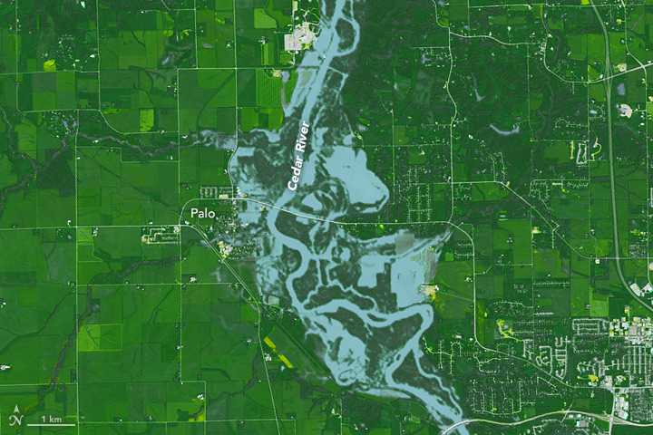
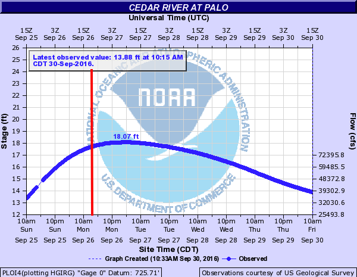
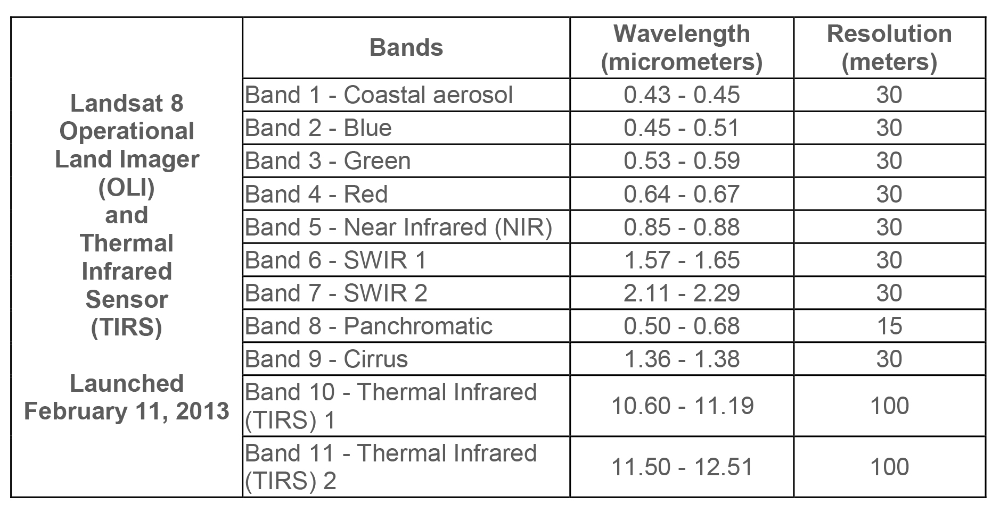

```{r, echo = FALSE, eval = TRUE}
#| fig-align: "center"
#| out.width: "100%"

```

# Background

On September 26, 2016 at 11:47 a.m. U.S. Central Daylight Time (16:47 UTC) the Cedar and Wapsipinicon rivers in Iowa surged producing a flood wave that breached the river banks. The water level of the Cedar River measured ~20 feet, 8 feet above flood stage, near the city of Cedar Rapids.

The water level continued to rise until it peaked at ~22 feet on September 27. This event had only been exceeded once, in June 2008, when thousands of people were encouraged to evacuate from Cedar Rapids, the second-most-populous city in Iowa.

```{r, echo = FALSE, eval = TRUE}
#| fig-align: "center"
#| out.width: "60%"

```

This investigation focuses on the impacts in Palo, Iowa, because it is upstream of Cedar Rapids, contains a large amount of farm land, and does not have a forecast location to provide warning. Using the `terra` and `rstac` packages, along with an understanding of raster data and categorization, it creates flood images from multiband Landsat imagery using thresholding and classification methods.

```{r}
#| echo: true
#| message: false
library(rstac) # STAC API
library(terra) # Raster Data handling
library(sf) # Vector data processing
library(mapview) # Rapid Interactive visualization
```

Almost all remote sensing and image analysis begins with the same basic steps: identify an area of interest (AOI), identify the temporal range of interest, identify the relevant images, download the images, and analyze the products.

## Identifying the Area and Time

The first step is to identify an AOI. To extract the flood extents for Palo, Iowa and its surroundings, the geocoding capabilities within the `AOI` package provide the bounding box.

The flood event occurred on September 26, 2016. A primary challenge with remote sensing is that all satellite imagery is not available at all times. In this case Landsat 8 has an 8 day revisit time, so to ensure an image within the date of the flood, the time range is set to the period between September 24th and 29th of 2016, defined in the form `YYYY-MM-DD/YYYY-MM-DD`.

## Finding the Images with STAC

The next step is to identify the images available for the AOI and time range. This is where the `rstac` package comes in, providing a simple interface to the SpatioTemporal Asset Catalog (STAC) API, a standard for discovering and accessing geospatial data. STAC describes geospatial data in a consistent way, standardizing the metadata of geospatial assets including their spatial and temporal extents, data formats, and other relevant information.

A STAC catalog is a collection of items and collections, serving as a top-level container. Items are the basic unit of data, each representing a single asset such as a satellite image, and containing metadata describing the asset. An asset is a specific file or data product associated with an item; a single satellite image may have multiple assets, such as different bands or processing levels, typically stored in cloud storage and accessed via URLs.

This analysis uses a STAC catalog to identify data from the Landsat 8 collection, which is served by the USGS (via AWS), Google, and Microsoft Planetary Computer (MPC). MPC provides free access, so it is the data store used here. The [full data holdings](https://planetarycomputer.microsoft.com/api/stac/v1) are available as JSON, where searching for `Landsat` finds the references for the available data stores. Within R, a connection to this endpoint opens with the `stac` function.

```{r}
# Open a connection to the MPC STAC API
stac_query <- stac("https://planetarycomputer.microsoft.com/api/stac/v1")
```

That connection provides an open entry to all data hosted by MPC. The `stac_search` function reduces the catalog to assets that match certain criteria, much like `dplyr::filter` reduces a `data.frame`, and `get_request()` sends the search to the STAC API, returning metadata about the matching objects (MPC sets a return limit of 250 items, overridable with the limit parameter). The collection of interest is "Landsat Collection 2 Level-2", searched via the `stac` to `stac_search` to `get_request` workflow refined to the AOI and time range.

The request then needs to be signed. In `rstac`, `items_sign(sign_planetary_computer())` signs STAC item asset URLs retrieved from Microsoft's Planetary Computer, ensuring they include authentication tokens for access. `sign_planetary_computer()` generates the signing function, and `items_sign()` applies it to STAC items, which is essential for accessing datasets hosted on the Planetary Computer and other catalogs where data access might be requester-paid or limited.

A Landsat 8 item has 11 bands in total.

```{r, echo = FALSE}

```

For this analysis, only the first 6 bands are needed. Assets are extracted from a STAC item by the asset name, so a vector of the wanted assets is defined.

```{r}
#| eval: false
# Bands 1-6
bands <- c('coastal', 'blue', 'green', 'red', 'nir08', 'swir16')
```

The `assets_download()` function then downloads the data, with `output_dir` specifying where to save the files and `overwrite` controlling whether existing files are replaced. From a set of local files, a raster object is built, with files in band order: `list.files()` searches a directory for a pattern and returns a list of files (with `recursive` searching sub-directories and `full.names` returning full paths), `rast()` reads the files into a raster object, and `setNames()` sets the band names to the values defined above.

The full setup, geocoding Palo, defining the date range and bands, and opening and signing the STAC connection, is below.

```{r}

# get AOI for Palo, Iowa
library(AOI)

aoi <- geocode("Palo, Iowa", bbox = TRUE)

mapview(aoi)

# Set date range

date_range <- "2016-09-24/2016-09-29"

bands <- c('coastal', 'blue', 'green', 'red', 'nir08', 'swir16')
# Open connection 

stac_query <- stac("https://planetarycomputer.microsoft.com/api/stac/v1") %>%
  stac_search(
  collections = "landsat-c2-l2",
  datetime = date_range,
  bbox = st_bbox(aoi),
  limit = 1) %>%
  get_request() %>%
  items_sign(sign_planetary_computer())


```

# Data Access

With the search signed, all the data for the analysis is downloaded, the files are listed and sorted into band order, read into a raster object, and named. This establishes the dimensions, CRS, and cell resolution of the stacked image.

```{r}
# Download the images needed 

assets_download(items = stac_query, 
                asset_names = bands, 
                output_dir = "data", 
                overwrite = T)

# List files 
l8_files <- list.files(
  path = "data/landsat-c2/level-2/standard/oli-tirs",
  pattern = "*.TIF$",
  full.names = TRUE,
  recursive = TRUE
)

# Sort bands
l8_files <- sort(l8_files)

l8_rast <- rast(l8_files)


l8_rast <- setNames(l8_rast, bands)

l8_rast
```

Only the regions surrounding Palo are of interest, so the AOI is transformed to the CRS of the Landsat stack and used to crop the raster stack.

```{r}

# Match AOI CRS to raster and crop
aoi <- st_transform(aoi, st_crs(l8_rast))

l8_crop <- crop(l8_rast, aoi)

l8_crop

```

The images are now identified, downloaded, and saved, loaded as a multiband `SpatRast` object and cropped to the AOI.

# Data Visualization

Multiple visualization pallets are created below: 

```{r}

# True Color
plotRGB(l8_crop, r = 4, g = 3, b = 2, stretch = "hist", 
        main = "Natural Color", mar = c(2, 2, 2, 2))

# Color infared
plotRGB(l8_crop, r = 5, g = 4, b = 3, stretch = "hist", 
        main = "Color Infared", mar = c(2, 2, 2, 2))

# False color water focus 
plotRGB(l8_crop, r = 5, g = 6, b = 4, stretch = "hist", 
        main = "False Color Water", mar = c(2, 2, 2, 2))

# SWIR NIR and Red plot
plotRGB(l8_crop, r = 6, g = 5, b = 4, stretch = "hist", 
        main = "SWIR, NIR, R", mar = c(2, 2, 2, 2))
```

The true color image gives us an idea of the setting, land cover types, and a general reference point. Color infrared shows us vegetation, with higher productivity vegetation appearing brighter. The false color water highlights water as a darker value since water absorbs most NIR light. The last plot aims to highlight water and show any differences in turbidity in the water.

# Indices and Thresholds {#q3}

Accurate assessment of surface water features like flooding has been made possible by remote sensing technology. Index methods are commonly used for surface water estimation using a threshold value. This part looks at five unique thresholding methods for delineating surface water features from different combinations of Landsat bands:

| **Name** | **Abbreviation** | **Formula** | **Water Threshold** |
|:----------------:|:----------------:|:----------------:|:----------------:|
| Normalized difference vegetation index | NDVI | $$ \frac{NIR - Red}{NIR + Red} $$ | Cells less then 0 |
| Normalized Difference Water Index | NDWI | $$ \frac{Green - NIR}{Green + NIR} $$ | Cells greater then 0 |
| modified |  |  |  |
| normalized difference water index | MNDWI | $$ \frac{Green - SWIR1}{Green + SWIR1} $$ | Cells greater then 0 |
| water ratio index | WRI | $$ \frac{Green + Red}{NIR + SWIR1} $$ | Cells greater then 1 |
| simple water index | SWI | $$ \frac{1}{\sqrt{Blue - SWIR1}} $$ | Cells less then 5 |

## Raster Algebra

Five new rasters are created using the formulas for NDVI, NDWI, MNDWI, WRI, and SWI, combined into a stacked object with `c()`, named, and plotted with a blue-white-red palette.

```{r}
index_names <- c("NDVI", "NDWI", "MNDWI", "WRI", "SWI")

ndvi <- (l8_crop$nir08 - l8_crop$red) / (l8_crop$nir08 + l8_crop$red)
ndwi <- (l8_crop$green - l8_crop$nir08) / (l8_crop$green + l8_crop$nir08)
mndwi <- (l8_crop$green - l8_crop$swir16) / (l8_crop$green + l8_crop$swir16)
wri <- (l8_crop$green + l8_crop$red) / (l8_crop$nir08 + l8_crop$swir16)
swi <- 1 / sqrt(l8_crop$blue - l8_crop$swir16)

index_rast <- c(ndvi, ndwi, mndwi, wri, swi) %>%
  setNames(index_names)

plot(index_rast, col = colorRampPalette(c("blue", "white", "red"))(256))
```

The five images all highlight water, but to different degrees and with different sensitivities to water. MNDWI appears to be the most sensitive at detecting surface water while SWI is the most restrictive and appears to only detect deeper water bodies.

## Raster Thresholding

The flood extents are extracted from each raster using the thresholds defined in the table above. The `app` function applies a custom formula for each calculated field that applies the threshold so that flooded cells are 1 and non-flooded cells are 0.

```{r}
ndvi_thresh <- app(ndvi, fun = function(x) ifelse(x < 0, 1, 0))
ndwi_thresh <- app(ndwi, fun = function(x) ifelse(x > 0, 1, 0))
mndwi_thresh <- app(mndwi, fun = function(x) ifelse(x > 0, 1, 0))
wri_thresh <- app(wri, fun = function(x) ifelse(x > 1, 1, 0))
swi_thresh <- app(swi, fun = function(x) ifelse(x < 5, 1, 0))


```

The `app` function applies a function to each cell of the raster, and `ifelse` sets the values based on the threshold. The five binary rasters are stacked with `c()`, named with meaningful descriptions, passed through one more classifier to set all NA values to zero, and plotted so floods are blue and background is white.

```{r}
water_thresh <- c(ndvi_thresh, ndwi_thresh, mndwi_thresh, wri_thresh, swi_thresh) %>%
  setNames(c("ndvi water", 
             "ndwi water", 
             "mndwi water", 
             "wri water", 
             "swi water")) %>% 
    app(fun = function(x) ifelse(is.na(x), 0, x))

plot(water_thresh, col = colorRampPalette(c("white", "blue"))(256))
```

Similarly to the non-threshold plots, MNDWI appears to have the highest sensitivity to water at the given threshold while SWI has the lowest sensitivity. Overall, all classifications are showing the same pattern in inundation, but there may be differences that occur from the ability to detect water at a given depth and threshold.

# Classification

An alternative way to identify similar features in a continuous field is through supervised or unsupervised classification. Supervised classification groups cells based on user-supplied "truth" locations. Since flood events are fast-occurring there are rarely truth points for a live event, so developers instead rely on libraries of flood spectral signatures. Unsupervised classification finds statistically significant groupings within the data, where the user specifies the number of classes and the categorization is created based on the patterns in the data. This part uses a simple k-means algorithm to group raster cells with similar spectral properties.

To produce a consistent and reproducible result from a random process in R, a seed is set with `set.seed`.

```{r}
set.seed(111)
```

The values are extracted from the 6-band raster stack with `values`, and the dimensions checked with `dim`. Each individual value in the matrix is now represented as a vector across the 6 bands.

```{r}
values <- values(l8_crop)

dim(values)

dim(l8_crop)
```

NA values are removed with `na.omit` for safety.

```{r}
values <- na.omit(values)
```

The k-means clustering algorithm from the `stats` package clusters the extracted raster data into a specified number of clusters `k` (centers), starting with 12. The output is a list of components, one of which is `cluster`, a vector of integers from 1 to `k` indicating the cluster to which each row was allocated.

```{r}

    library(stats)

    k_12 <- kmeans(values, centers = 12)
```

A new raster object is created by copying one of the original bands, and its values are set to the cluster vector from the k-means output. This is repeated with both 12 and 4 clusters to see how the map changes.

```{r}

k_ras <- l8_crop$nir08

values(k_ras) <- k_12$cluster

plot(k_ras, col = colorRampPalette(c("white", "blue", "red"))(256), main = "K-means with 12 Clusters")

# K means with 4 clusters 

k_4 <- kmeans(values, centers = 4)

k_4_ras <- l8_crop$nir08

values(k_4_ras) <- k_4$cluster

plot(k_4_ras, col = colorRampPalette(c("white", "blue", "red"))(256), main = "K-means with 4 Clusters")


```

The result is a categorical raster with categories 1 to k, but the category that corresponds to flood water is unknown. To identify the flood category programmatically, a contingency `table` crosses the values of one binary flood raster with the values of the kmeans raster. `table` counts the number of times each combination of factor levels occurs, quantifying how many cells with value 1 align with each of the k classes and how many cells with value 0 align with each class. Passing the binary flood values as the first argument makes the unique values (0, 1) the rows, sorted so the flooded cells are the second row. `which.max()` returns the index of the maximum value in a vector, which combined identifies the cluster that coincides with the most flooded cells. `app` then extracts that flood mask in the same way as the thresholding above, and the result is added to the flood raster stack with `c()`.

```{r}

water_table <- table(values(water_thresh$`ndvi water`), values(k_ras))

water_table

water_value <- which.max(water_table[2,])

water_value

k_water <- app(k_ras, fun = function(x) ifelse(x == water_value, 1, 0))

plot(k_water, col = colorRampPalette(c("white", "blue"))(256), main = "K-means Water Classification")

water_thresh$`k-means water` <- k_water

plot(water_thresh, col = colorRampPalette(c("white", "blue"))(256))
```

# Comparing the Methods

The flood raster has now been created using six different methods, and the last goal is to identify how they compare. First, the total area of the flooded cells in each image is calculated. `global` determines the sum of each layer, and since flooded cells have a value of 1, the sum of an entire band is equivalent to the number of flooded cells, which the cell resolution converts to a flooded area.

```{r}
counts <- global(water_thresh, "sum", na.rm = TRUE)

counts$area_km2 <- (counts$sum * 900) / 1000000

print(counts)

```

Second, the uncertainty in the classifications is visualized by summing the entire stack with `app`. The higher the count in each pixel, the more certain the flooded state: a cell value of 6 means every method identified the cell as flooded, while a value of 2 means two methods did. The uncertainty map uses the blues9 palette.

```{r}
water_uncert <- app(water_thresh, sum, na.rm = TRUE)

plot(water_uncert, col = blues9, main = "Water Classification Uncertainty")
```

Third, the summed raster is copied as a new layer with all 0 values set to NA, then mapped interactively with `mapview` so pixel-level values are displayed on the map.

The uncertainty raster identifies how many times a classification method identified a cell as water, so if 5 methods identified water then the pixel value will be five, since we summed a stack of binary values. This is why some cell values are not even numbers.

```{r}

uncert_ras <- water_uncert

values(uncert_ras) <- ifelse(values(uncert_ras) == 0, NA, values(uncert_ras))

mapview(uncert_ras, col.regions = blues9, layer.name = "Water Uncertainty")
```

This completes a full flood analysis from data acquisition through evaluation. This kind of work goes on regularly and is part of several national efforts (NOAA, USGS, FirstStreet, FEMA) to generate flood inundation libraries that contribute to better extraction and classification of realtime flood events, resource allocation during events, and damage assessments afterward. Landsat imagery was used here, but the same process could be implemented on drone footage, MODIS data, or other private satellite imagery.

The evaluation was based purely on the raster data structure and on conceptualizing rasters as vectors of data with dimensional structure. Simple mathematical operators (+, /, -) were applied to the raster bands, along with a kmeans clustering algorithm to the data matrix of the multiband raster, all within roughly 100 lines of code.
